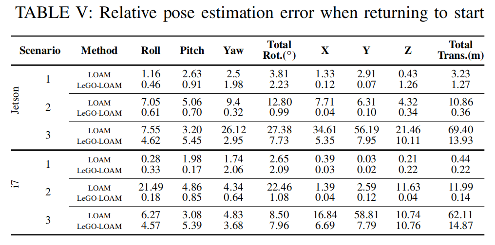
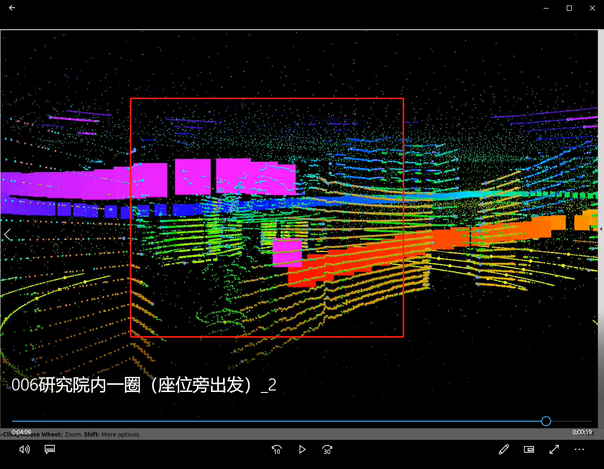
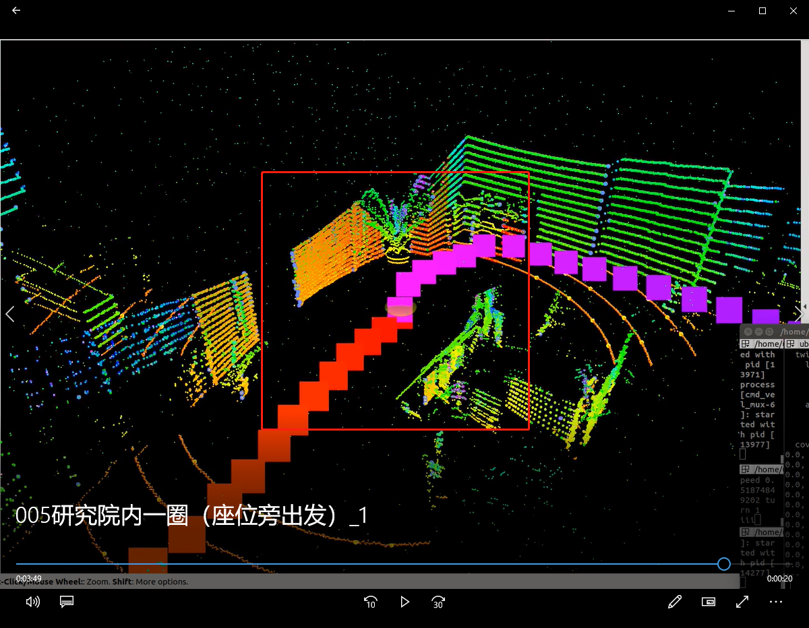
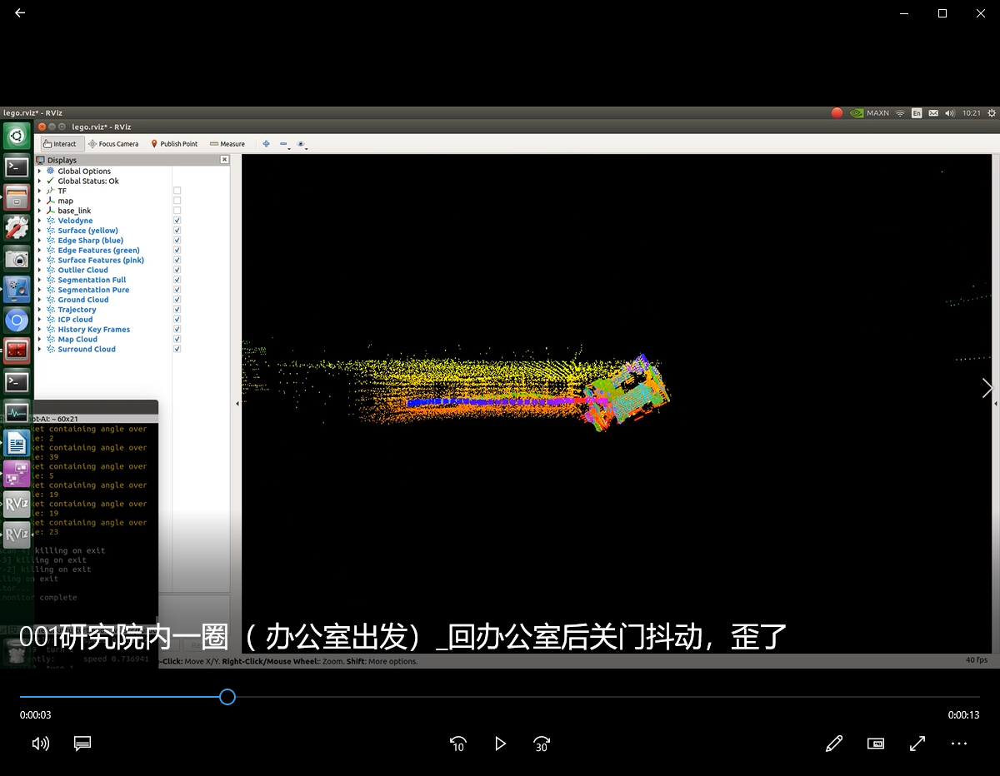
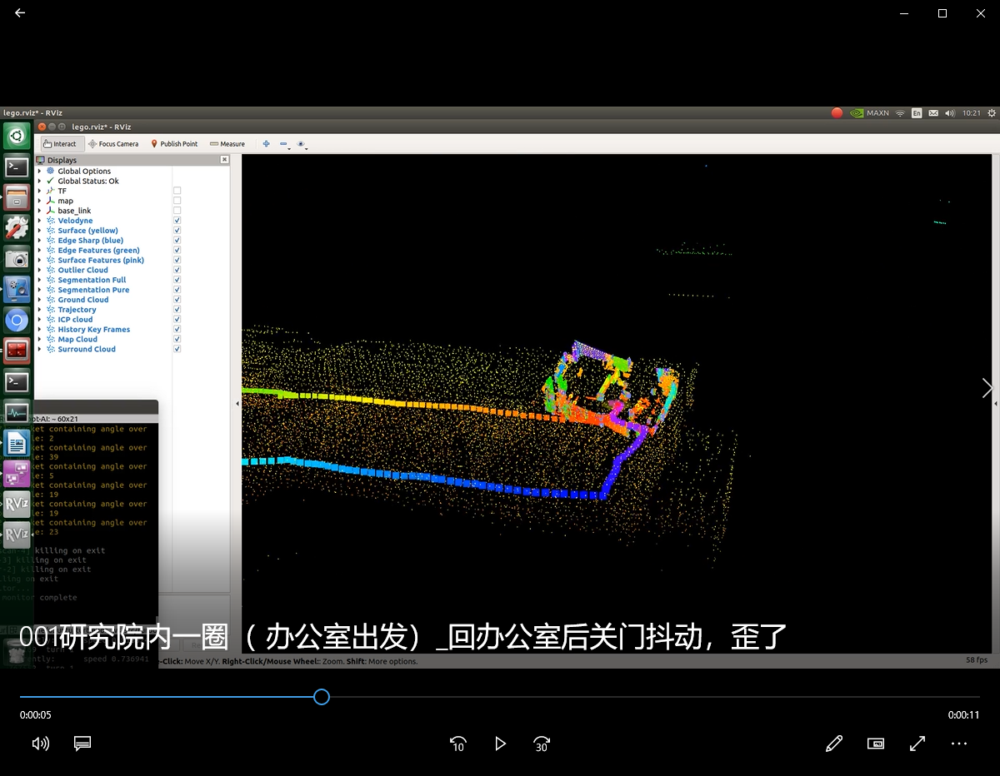
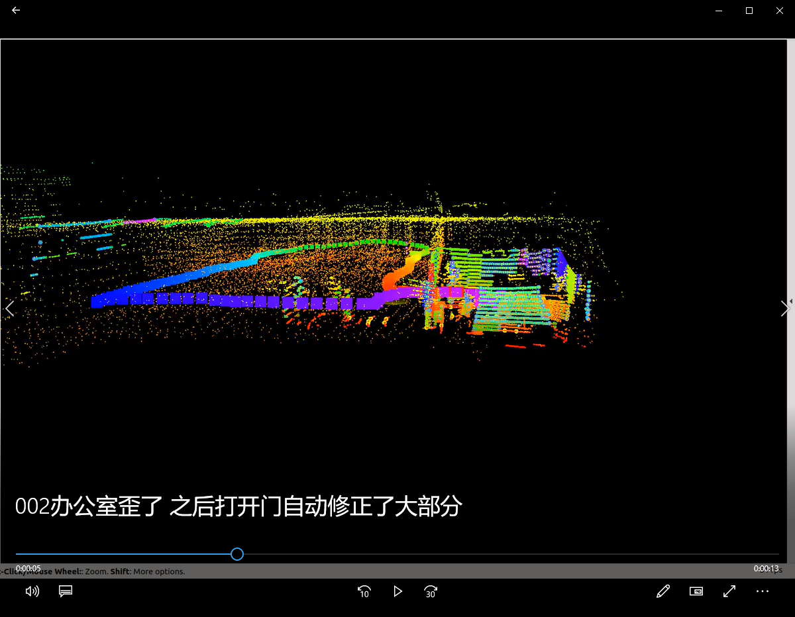

# LeGO-LOAM里程计效果评估

## 原论文：

LeGO-LOAM论文中，小车绕行回到原点后，计算LeGO-LOAM里程计当前读数与初始原点之间的平移误差以及旋转误差。



---

## 本项目

平移和旋转四元数的初始值分别为：[0,0,0]、[0,0,0,1]

实验序号|场地|速度|里程计|Tx|Ty|Tz|平移总误差（m）|Qx|Qy|Qz|Qw|旋转总误差|
-|-|-|-|-|-|-|-|-|-|-|-|-|
1|研究院内|0.2|LeGO-LOAM|0.00|0.00|0.26|0.26|0.01|0.01|0.00|1.00|0.00|
1|研究院内|0.2|车轮里程计|-0.21|3.53|0.00|3.54|0.00|0.00|-0.14|0.99|0.14|
2|研究院内|0.2|LeGO-LOAM|0.00|-0.05|0.28|0.28|-0.02|0.01|-0.01|1.00|0.02|
2|研究院内|0.2|车轮里程计|0.77|-2.31|0.00|2.43|0.00|0.00|0.08|1.00|0.08|
3|研究院内|0.2|LeGO-LOAM|-0.01|-0.07|0.81|0.81|-0.04|0.03|0.01|1.00|0.05|
3|研究院内|0.2|车轮里程计|-0.07|1.38|0.00|1.38|0.00|0.00|-0.04|1.00|0.04|
4|室外园区内|0.7|LeGO-LOAM||||||||||
4|室外园区内|0.7|车轮里程计||||||||||
5|室外园区内|0.7|LeGO-LOAM||||||||||
5|室外园区内|0.7|车轮里程计||||||||||
6|室外园区内|0.7|LeGO-LOAM||||||||||
6|室外园区内|0.7|车轮里程计||||||||||

---

## 总结

#### 室内小环境：
- 小车行进时，刹车会造成车身大幅度摇晃颠簸，Z轴误差相对大

```
链接：https://pan.baidu.com/s/1bk1RkcWNf4eWdhDRR3FBZA 
提取码：bhjx
```

- 若平缓行走则Z轴闭环情况良好

```
链接：https://pan.baidu.com/s/1KWftJ8VhMghb9mLf6V_p4Q 
提取码：bhjx 
```


#### 室外大场地：

---

## 其他：关门后建图扭曲

还测试了一种从办公室出发回到办公室的路线，回到办公室后，关上门，则屋内与办公室外大厅不连通，在屋内旋转，建图容易发生扭曲变形：


```
链接：https://pan.baidu.com/s/15qsD7W11WMK7c4wpAeUV4A 
提取码：bhjx 
```

打开门后修正：

```
链接：https://pan.baidu.com/s/1wyxe0ev4JoDxK5df8qrJrA 
提取码：bhjx
```