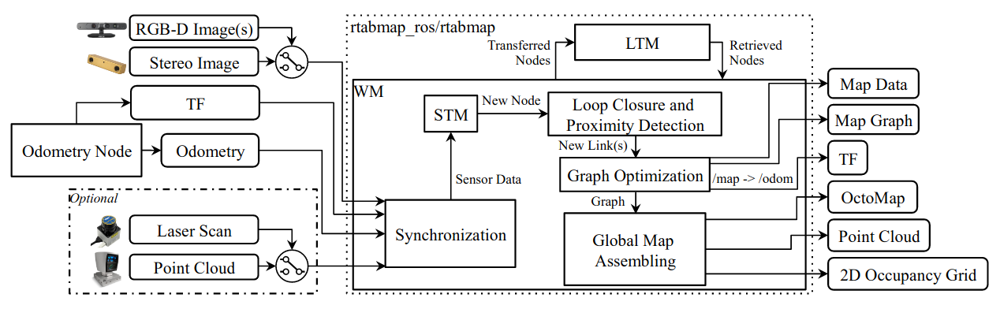
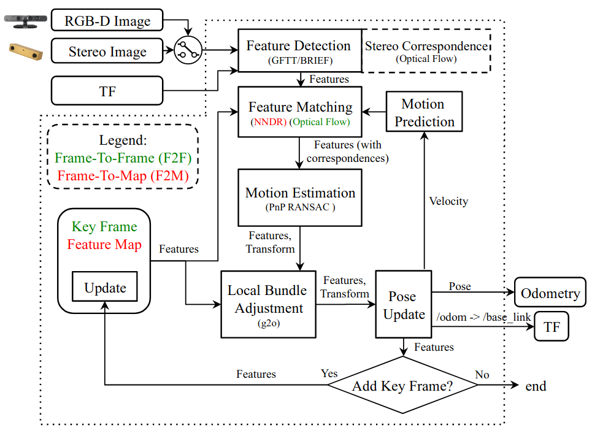
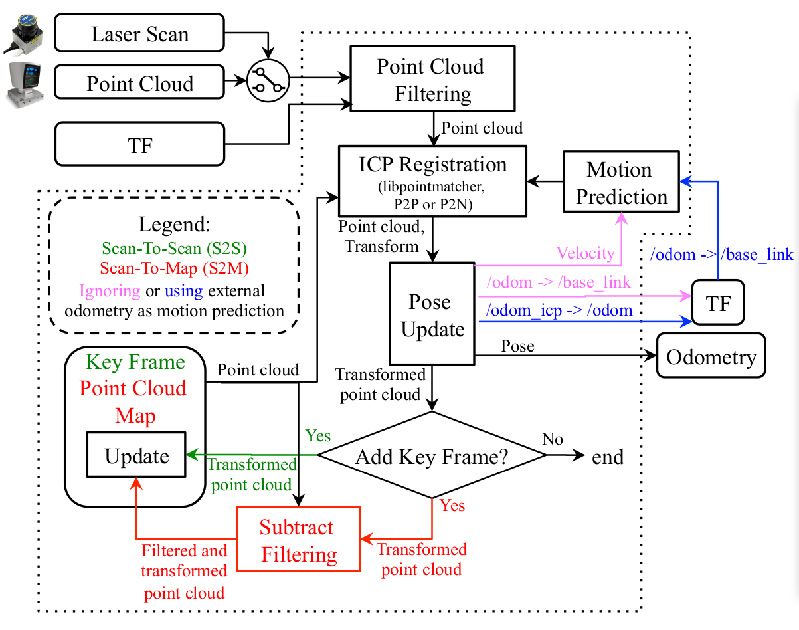

## 介绍

　　RTAB-Map是基于图的SLAM方法，自2013年以来已作为rtabmapros7软件包集成在ROS中。图1显示了其主要的ROS节点rtabmap。里程计是RTAB-Map的外部输入，这意味着SLAM也可以使用任何一种里程计来完成，以使用适合给定应用程序和机器人的功能。地图的结构是带有节点和链接的图。传感器同步后，短期内存（STM）模块将创建一个节点，用于存储里程计姿态，传感器的原始数据以及对下一个模块有用的其他信息（例如，用于闭环和邻近检测的可视单词，以及用于全局地图装配的局部占用网格）  。根据从节点创建的数据相互重叠的多少，以固定的“ Rtabmap / DetectionRate”速率（以毫秒为单位）创建节点。例如，如果机器人运动迅速且传感器范围较小，则应提高检测率以确保连续节点的数据重叠，但是将其设置得过高则会不必要地增加内存使用量和计算时间。链接包含两个节点之间的刚性转换。共有三种链接：邻居链接，闭环链接和邻近链接。通过里程计转换在相邻节点之间的STM中添加邻居链接。分别通过闭环检测或接近检测来添加闭环和邻近链接。所有链接都被用作图优化的约束。当在图形上添加了新的闭环或邻近链接时，图形优化会将计算出的误差传播到整个图形，以减少里程计漂移。通过优化图形，可以组装OctoMap，点云和2D占领网格输出，并将其发布到外部模块。还可以通过ff [Foote，2013] / map→/ odom进行测程法校正以得出机器人在地图框中的位置。

##### 图1：rtabmapROS节点的框图。所需的输入是：TF，用于定义传感器相对于机器人基座的位置； 任何来源的里程计（可以是3DoF或6DoF）； 相机输入之一（一个或多个RGB-D图像，或立体声图像）以及相应的校准消息。可选输入是来自2D激光雷达的激光扫描或来自3D激光雷达的点云。然后将来自这些输入的所有消息同步并传递给graph-SLAM算法。输出为：Map Data，其中包含最新添加的带有压缩传感器数据的节点和图形； 没有任何数据的Map Graph； 里程计校正发布在TF上； 可选的OctoMap（3D占用网格）； 可选的密集点云； 可选的2D占用网格。

　　RTAB-Map的内存管理方法[Labb́e and Michaud，2013]在图形管理模块之上运行。它用于限制图形的大小，以便可以在大型环境中实现长期在线SLAM。如果没有内存管理，则随着图形的增长，诸如LoopClosure和接近检测，图形优化和全局地图组装之类的模块的处理时间最终可能会超出实时限制，即处理时间可能变得大于节点采集周期时间。基本上，RTAB-Map的内存分为工作内存（WM）和长期内存（LTM）。当节点转移到LTM时，WM内部的模块不再可用。当RTAB-Map的更新时间超过固定时间阈值“ Rtabmap / TimeThr”时，WM中的某些节点将转移到LTM以限制WM的大小并减少更新时间。与固定时间阈值相似，还有一个内存阈值“ Rtabmap / MemoryThr”，可用于设置WM可以容纳的最大节点数。为了确定要转移到LTM的节点，加权机制使用启发式方法（例如，观察到的位置越长，则越重要）来标识比其他位置更重要的位置，因此应将其保留在WM中。为此，在创建新节点时，STMinitial将节点的权重设置为0，然后将其权重与图形中的最后一个节点进行可视化比较（得出相应的视觉单词的百分比）。如果它们是相似的（相应的视觉单词的百分比超过相似阈值“ Mem / RehearsalSimilarity”），则新节点的权重加最后一个节点的权重。最后一个节点的权重重置为0，如果机器人不移动，则最后一个节点将被丢弃，以避免无用地增加图形大小。当达到时间或内​​存阈值时，最小的加权节点中最早的节点将首先传输到LTM。当WM中某个位置发生闭环时，可以将该位置的邻居节点从LTM带回到WM，以进行更多的闭环和邻近检测。当机器人在先前访问的区域中移动时，它可以逐渐记住过去的位置，以扩展当前的组合地图并使用过去的位置进行定位[Labb́e and Michaud，2017]。下一节将更详细地说明RTAB-Map的流程，从Odometry节点到GlobalMap组装。提供了用于配置和使用RTAB-Map的关键参数的定义。

## 里程计节点

　　里程计节点可以实现任何类型的里程计方法，从车轮编码器和IMU衍生出的更简单方法，再到使用相机和激光雷达的更复杂方法。与所使用的传感器无关，它应至少向RTAB-Map提供到目前为止已估计的机器人的姿态，该姿态已通过具有相应tf变换（例如/ odom→/ baselink）的里程计消息8的形式进行了估算。当机器人尚无法使用本体感受测距法或其精度不够高时，必须使用基于视觉或激光雷达的测距法。对于视觉里程计，RTAB-Map实现了两种标准的里程计方法[Scaramuzza andFraundorfer，2011]，称为帧到图（F2M）和帧到帧（F2F）。这些方法之间的主要区别在于，F2F将新帧与最后一个关键帧进行配准，而F2M将新帧与从过去的关键帧创建的特征的本地图进行配准。这两种方法也适用于激光雷达，被称为“扫描到地图（S2M）”和“扫描到扫描（S2S）”，遵循与F2M和F2F相同的思想，但是使用点云而不是3D视觉功能。下面sectionsshow如何办法时选择这些视觉或激光雷达测距的一个里程计节点中实现。

### 视觉里程计

##### 图2：rgbd_odometry和stereo_odometry ROS节点的框图。TF定义了相机相对于机器人底座的位置，并作为输出以发布机器人底座的测程变换。对于RGB-D相机或立体相机，管线相同，不同之处在于稍后会计算立体对应关系以确定检测到的特征的深度。可以使用两种测距方法：绿色的帧到帧（F2F）方法和红色的帧到地图（F2M）方法。

　　图2展示了RTAB-Map的视觉里程计，其中使用了两种颜色来区分F2F（绿色）和F2M（红色）。它可以使用RGB-D或立体声摄像机作为输入。tf要求知道摄像机在机器人上的放置位置，以便将输出里程数转换为机器人基本帧（例如/ baselink）。如果摄像机位于机器人的头部并且头部转动，则只要更新了机器人的身体和机器人头部之间的距离，它就不会影响机器人底座的里程计。该过程如下。

- 特征检测：
捕获帧后，将以“ Vis / MaxFeatures”参数固定的最大数量来检测“GFTT角点”特征。RTAB-Map支持OpenCV中可用的所有特征类型，但选择GFTT可以简化参数调整，并在不同的图像尺寸和光强度下获得一致检测到的特征。对于深度图像，使用LK（稀疏光流）迭代通过光流计算深度对应关系，以得出左右图像之间每个特征的视差。对于RGB-D图像，深度图像用作遮罩。GFTT避免在有效深度内提取特征。

- 特征匹配：
对于F2M，匹配是通过最近的邻居距离比（NNDR , nearest neighbor distance ratio）测试来完成的，使用提取的特征的BRIEF描述子与特征图中的特征进行BRIEF​​描述。特征图包含3D特征，以及来自最后关键帧的描述子。NNDR由参数“ Vis / CorNNDR”定义。
对于F2F，光流直接在GFTT特征上完成，而无需提取描述子，从而提供了与关键帧更快的特征对应。

- 运动预测：
基于先前的运动变换，运动模型用于预测关键帧（F2F）或特征图（F2M）的特征在当前帧中的位置。
这限制了特征匹配的搜索窗口提供更好的匹配，特别是在具有动态对象和重复纹理的环境中。搜索窗口的半径由参数“ Vis / CorGuessWinSize”定义，并使用等速运动模型。

- 运动估计：
计算对应关系时，OpenCV的Perspective-n-Point（PnP）RANSAC实现用于根据关键帧（F2F）或特征图（F2M）中的特征来计算当前帧的转换。。需要最小内参“ Vis / MinInliers”来接受转换。

- 局部光束法平差：
通过对特征映射（F2M）中的所有关键帧或仅对最后一个关键帧（F2F）的特征进行局部光束法平差(Bundle Adjustment)，可以优化转换结果。

- 姿势更新：
通过估算的转换，输出里程计随后也会更新，以及tf的/ odom→/baselink转换。 使用3D特征对应之间的中位数绝对偏差（MAD）方法计算协方差。

- 关键帧和特征图更新：
如果在“运动估计”期间计算的内参数低于固定阈值“ Odom / KeyFrameThr”，则将更新关键帧或特征图。
对于F2F，仅将关键帧替换为当前帧。
对于F2M，通过添加新框架的不匹配特征并更新由“局部光束法平差”模块完善的匹配特征的位置来更新特征地图。功能图具有固定的最大数量的临时功能（因此，最大关键帧）。当特征映射的大小超过固定阈值“ OdomF2M / MaxSize”时，与当前帧不匹配的最旧特征将被删除。如果关键帧不再在“特征地图”中具有特征，则将其丢弃。

### 雷达里程计

##### 图3：icp里程表ROS节点的框图。  TF定义了激光雷达相对于机器人基座的位置，并作为输出发布了机器人基座的测距变换。 可以使用两种测距方法：绿色的扫描到扫描（S2S）方法和红色的扫描到地图（S2M）方法。 这些方法还可以选择使用恒定速度模型（粉红色）或其他里程表来源（蓝色）进行运动预测。 稍后，输入里程表的校正将发布在TF上。

　　图3提供了激光雷达测距的方框图，也使用两种颜色来区分S2S（绿色）和S2M（红色）。 使用类似于视觉里程表的术语，关键帧是指点云或激光扫描。 激光扫描输入为2D，因为点云输入可以为2D或3D。 当机器人在扫描过程中移动时，激光扫描会产生一些运动变形。 在此假定在将扫描输入RTAB-Map之前纠正了这种失真。 请注意，如果激光扫描仪的旋转频率相对于机械手速度而言较高，则激光扫描的运动失真将非常低，因此可以忽略校正而不会显着降低套准精度。 该过程描述如下：

- 点云过滤：对输入点云进行降采样并计算法线。  tf用于将点云转换为机器人基础框架，以便相应地计算里程（例如/ base链接）。

- ICP注册：要将新的点云注册到点云图（S2M）或最后一个关键帧（S2S），请使用libpointmatcher [Pomerleau等人]实现迭代最近点（ICP）[Besl和McKay，1992]。  。，2013]。 点云地图是由过去的关键帧组成的云。可以使用点对点（P2P）或点对平面（P2N）对应关系进行注册。  P2N在具有许多平面的人造环境中是首选。

- 运动预测：由于ICP正在处理未知的对应关系，因此该模块需要先进行有效的运动预测，然后才能通过tf（通过蓝色和紫色分别显示）从先前的配准或外部测距方法（例如，车轮测距）通过先前的配准。仅在处理两个前帧时，才在初始化时提供身份变换作为运动预测。 如果未使用外部里程计作为初始猜测，则根据基于先前变换的等速模型进行运动预测。 该技术的问题在于，如果环境不够复杂（例如在走廊中），则如果对机器人的方向没有限制，则里程表可能会漂移很多。 在这种情况下，使用外部初始猜测可以帮助估计环境缺乏特征的方向上的运动。 例如，具有短距离激光雷达的机器人在没有门（即无法区分的几何形状）的长走廊中移动时，只会看到两条平行线。 如果机器人在走廊的方向上加速或减速，则ICP能够校正方向，但无法检测到走廊的速度变化。 在这种情况下，使用外部测距法可以帮助估计ICP无法测出的速度。 如果当前点云的结构复杂度低于固定阈值“ Icp / PointToPlaneMinComplexity”，则仅使用ICP估计方向，并从外部测距法得出位置（沿着有问题的方向）。  2D点云的结构复杂度定义为点云法线的主成分分析（PCA）的第二特征值乘以2。 对于3D点云，将第三特征值乘以三。

## 同步

## STM

## 回环闭合与接近检测

## 图优化

## 全局地图拼接