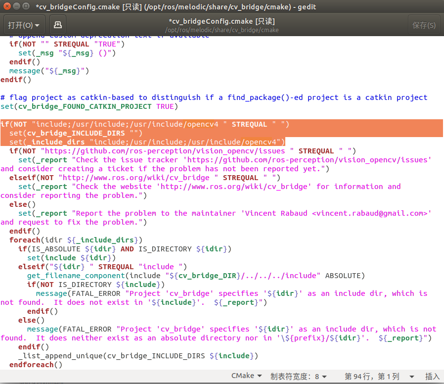
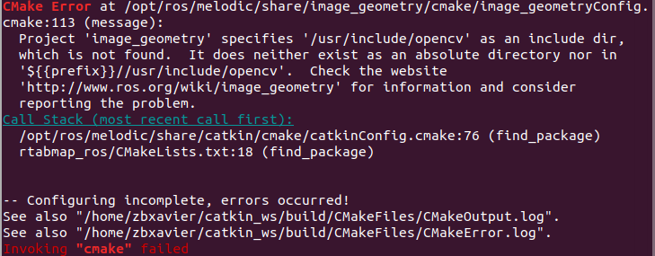
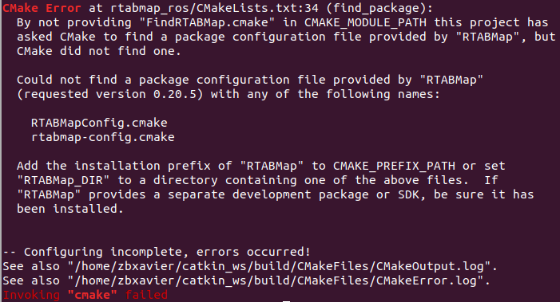
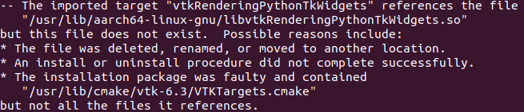
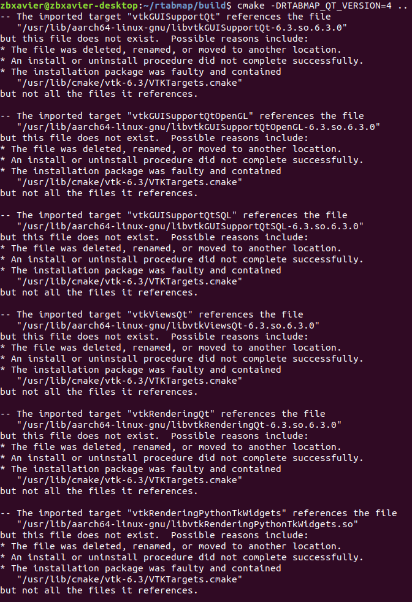
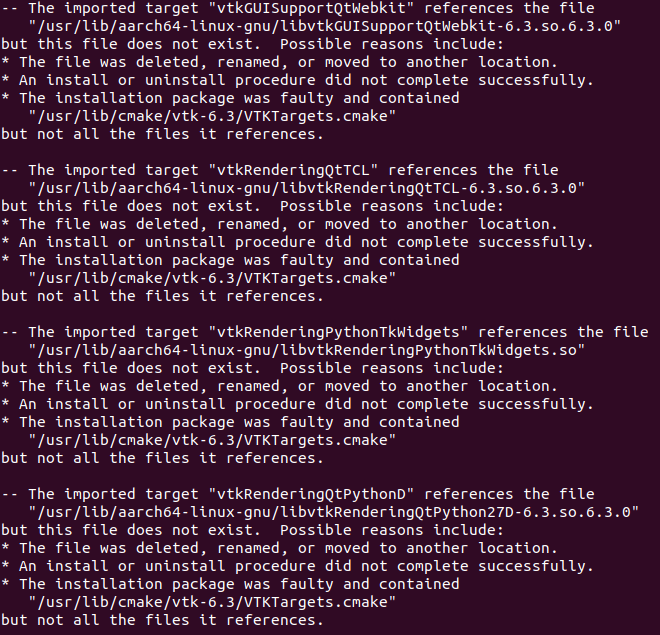

# 问题及解决方法

### Project 'cv_bridge' specifies '/usr/include/opencv' as an include dir,  which is not found.


```
sudo gedit /opt/ros/melodic/share/cv_bridge/cmake/cv_bridgeConfig.cmake
```



将所有的`/usr/include/opencv`改为`/usr/include/opencv4`

---

### Project 'image_geometry' specifies '/usr/include/opencv' as an include dir, which is not found.



```
sudo gedit /opt/ros/melodic/share/image_geometry/cmake/image_geometryConfig.cmake
```


将所有的`/usr/include/opencv`改为`/usr/include/opencv4`


---

### By not providing "FindRTABMap.cmake" in CMAKE_MODULE_PATH this project has asked CMake to find a package configuration file provided by "RTABMap", but CMake did not find one.



未安装rtabmap的独立库，需要编译安装。


---

### The imported target "vtkRenderingPythonTkWidgets" references the file   "/usr/lib/aarch64-linux-gnu/libvtkRenderingPythonTkWidgets.so" but this file does not exist.



先用软连接

```
cd /usr/bin
ls vtk*
sudo ln -s vtk6 vtk

```

```
https://github.com/introlab/rtabmap/issues/427#issuecomment-516914817
```

copy
```
sudo cp libvtkGUISupportQt* /usr/lib/aarch64-linux-gnu/.
sudo cp libvtkRenderingQt* /usr/lib/aarch64-linux-gnu/.
sudo cp libvtkGUISupportQtSQL* /usr/lib/aarch64-linux-gnu/.
sudo cp libvtkViewsQt* /usr/lib/aarch64-linux-gnu/.

sudo cp vtkGUISupportQt.cmake /usr/lib/cmake/vtk-6.3/Modules/.
sudo cp vtkGUISupportQtOpenGL.cmake /usr/lib/cmake/vtk-6.3/Modules/.
sudo cp vtkGUISupportQtSQL.cmake /usr/lib/cmake/vtk-6.3/Modules/. 
sudo cp vtkRenderingQt.cmake /usr/lib/cmake/vtk-6.3/Modules/.
sudo cp vtkViewsQt.cmake /usr/lib/cmake/vtk-6.3/Modules/.
```

把带有qt5的都注释掉：
```
sudo gedit /usr/lib/cmake/vtk-6.3/VTKTargets.cmake

sudo gedit /usr/lib/cmake/vtk-6.3/VTKTargets-none.cmake
```


```
cd /usr/lib/aarch64-linux-gnu

sudo rm libvtkGUISupportQtOpenGL-6.3.so.6.3.0 libvtkGUISupportQt-6.3.so.6.3.0  libvtkRenderingQt-6.3.so.6.3.0 libvtkGUISupportQtSQL-6.3.so.6.3.0  libvtkViewsQt-6.3.so.6.3.0  libvtkInteractionStyle-6.3.so.1  libvtkRenderingOpenGL-6.3.so.1  libvtkRenderingCore-6.3.so.1 libvtkFiltersExtraction-6.3.so.1  libvtkCommonDataModel-6.3.so.1 libvtkCommonCore-6.3.so.1
```

```
sudo ln -s  libvtkGUISupportQtOpenGL-6.3.so.1 libvtkGUISupportQtOpenGL-6.3.so.6.3.0
sudo ln -s  libvtkGUISupportQt-6.3.so.1 libvtkGUISupportQt-6.3.so.6.3.0
sudo ln -s  libvtkRenderingQt-6.3.so.1 libvtkRenderingQt-6.3.so.6.3.0
sudo ln -s  libvtkGUISupportQtSQL-6.3.so.1 libvtkGUISupportQtSQL-6.3.so.6.3.0
sudo ln -s  libvtkViewsQt-6.3.so.1 libvtkViewsQt-6.3.so.6.3.0

sudo ln -s libvtkInteractionStyle-6.3.so.6.3.0 libvtkInteractionStyle-6.3.so.1
sudo ln -s libvtkRenderingOpenGL-6.3.so.6.3.0 libvtkRenderingOpenGL-6.3.so.1 
sudo ln -s libvtkRenderingCore-6.3.so.6.3.0 libvtkRenderingCore-6.3.so.1
sudo ln -s libvtkFiltersExtraction-6.3.so.6.3.0 libvtkFiltersExtraction-6.3.so.1
sudo ln -s libvtkCommonDataModel-6.3.so.6.3.0 libvtkCommonDataModel-6.3.so.1
sudo ln -s libvtkCommonCore-6.3.so.6.3.0 libvtkCommonCore-6.3.so.1
```


```
cd ~
cd rtabmap/build
cmake -DRTABMAP_QT_VERSION=4 ..
```

又报错：`"/usr/lib/aarch64-linux-gnu/libvtkGUISupportQt-6.3.so.6.3.0" but this file does not exist. `

---

### 


---

### 



仔细检查，重新复制

---

### 



```
ls ~/备份/libvtkGUISupportQtWebkit*
sudo cp ~/备份/libvtkGUISupportQtWebkit* /usr/lib/aarch64-linux-gnu

```

```
ls ~/备份/libvtkRenderingQtTCL*
sudo cp ~/备份/libvtkRenderingQtTCL* /usr/lib/aarch64-linux-gnu
```

```
sudo ln -s /usr/lib/python2.7/dist-packages/vtk/libvtkRenderingPythonTkWidgets.aarch64-linux-gnu.so /usr/lib/aarch64-linux-gnu/libvtkRenderingPythonTkWidgets.so
```

```
ls ~/备份/libvtkRenderingQtPython27D-6.3*
sudo cp ~/备份/libvtkRenderingQtPython27D-6.3* /usr/lib/aarch64-linux-gnu
```

---

### 


---
