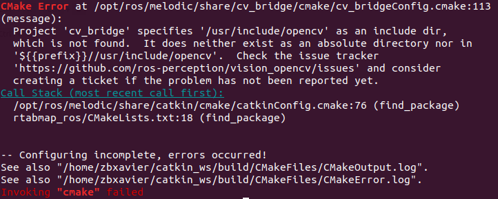
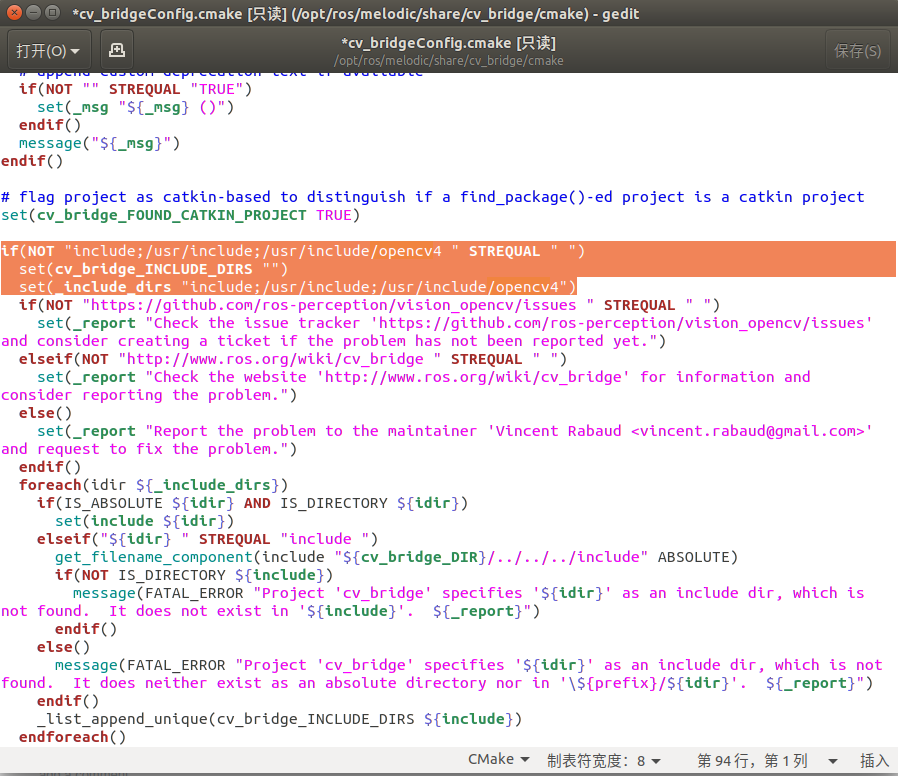

# 问题及解决方法

### Project 'cv_bridge' specifies '/usr/include/opencv' as an include dir,  which is not found.



```
sudo gedit /opt/ros/melodic/share/cv_bridge/cmake/cv_bridgeConfig.cmake
```



将所有的`/usr/include/opencv`改为`/usr/include/opencv4`


---


