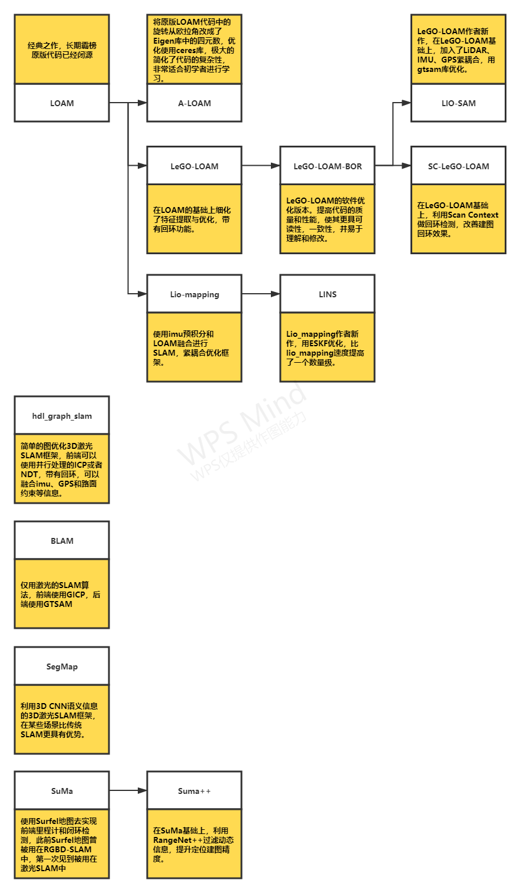

# 3D激光SLAM研究计划及进展

---

## 研究计划

- 阅读LOAM论文《LOAM: Lidar Odometry and Mapping in Real-time》
- 研究A-LOAM代码
- 阅读LeGO-LOAM论文《LeGO-LOAM: Lightweight and Ground-Optimized
Lidar Odometry and Mapping on Variable Terrain》
- 研究LeGO-LOAM-BOR代码
- 阅读LIO-SAM论文《LIO-SAM: Tightly-coupled Lidar Inertial Odometry via
Smoothing and Mapping》
- 研究LIO-SAM代码

---

## 理论知识

---

## 论文

---

## 工具库

---

