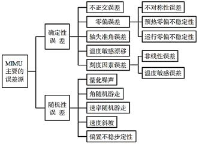

# IMU指标及购买评估

## IMU情况说明

IMU的误差：
- 测量误差，由购买的IMU精度决定
- 初始误差，IMU出厂校正，使用一段时间后（几年）若出现偏差需要返厂修正
- 与雷达的位姿误差，用雷达进行联合标定

注：只有在IMU本身误差不大的情况下，与雷达的标定才有效果 。

---

## IMU性能及评估指标

#### IMU主要的误差来源

#### 主要参考的性能评估指标及其意义：

- 零偏：
在陀螺静止时，陀螺仪仍会，以规定时间内测得的输出量平均值相应的等效输入角速率表示，单位为°/h，°/s。理想状态下该数值应为地球自转角速度的分量。在角速度输入为零时，陀螺仪的输出是一条复合白噪声信号缓慢变化的曲线，曲线的平均值就是零偏值。

- 零偏稳定性：
单位大多为°/h，这个参数是用Allan方差计算的，是Allan方差的最低点，与陀螺的零偏稳定性单位相同，但是二者的数值没有固定的关系。

- 陀螺仪角随机游走：
因角速度的白噪声而引起的一定时间的角度误差。

评估指标|STIM300|STIM318|Razor IMU|orientus|
-|-|-|-|-|-|-|
价格|5万元左右|6万元左右|244元|1.25万元|
采样率|2000Hz|2000Hz|6.25Hz-3200Hz|1000 Hz|
加速度计零偏稳定性|0.05mg|0.003mg|xy轴150mg，z轴250mg|0.06mg|
陀螺仪零偏稳定性|0.3°/h|0.3°/h|无指标|18°/h|
陀螺仪角随机游走|0.15°/√h|0.15 °/√h|无指标|暂无数据|

主要的差距就在于加速度计和陀螺仪的零偏稳定性，以及陀螺仪的角度随机游走上。

#### STIM300

需要自己写底层串口通信，封装ROS

参数资料
链接：https://pan.baidu.com/s/1UIPDMfbxpWlPirVt6WYynQ 
提取码：bhjx

#### STIM318

需要自己写底层串口通信，封装ROS

参数资料
链接：https://pan.baidu.com/s/1mCLlqthHeqPWdZQe9NgokQ 
提取码：bhjx

#### 

#### Razor IMU

淘宝能买到刷好ROS的

https://www.sparkfun.com/products/retired/10736

由ITG-3200陀螺仪、ADXL345加速度计、HMC5883L磁力计三个设备集成而成。

#### SparkFun 9DoF IMU Breakout - LSM9DS1

https://www.sparkfun.com/products/13284

只能从sparkfun官网上买

#### ZED2

发了邮件还未回复

---

