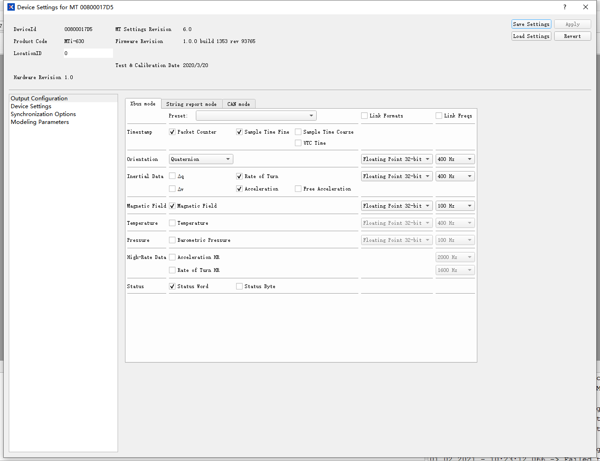

# xsens 安装配置记录


- 安装ros驱动
```
sudo apt-get install ros-melodic-xsens-driver
```

下载软件包
```
链接：https://pan.baidu.com/s/1NtMoWnVu2NhpfZzoKpHYIA 
提取码：bhjx 
```


- 安装sdk（文件在软件包中）
```
sudo ./mtsdk_linux-x64_2020.3.sh
```

- 在windows上安装MT manager（文件在软件包中，仅配置时需要）

配置如下：


- 下载并编译demo（从github）

xsens_ros_mti_driver
```
pushd src/xsens_ros_mti_driver/lib/xspublic && make && popd

catkin_make -j8


- 运行demo
```
sudo chmod 777 /dev/ttyUSB*

roslaunch xsens_mti_driver display.launch
```

此时已经可以读取到/imu/data数据

---

https://content.xsens.com/download-mt-software-suite?submissionGuid=3389d0c2-f247-448a-9cb2-8f8a81c41cd7


https://www.xsens.com/hubfs/Downloads/Software/MTSS/Releases/2020.3.0-beta/MT_Software_Suite_linux-x64_2020.3.tar.gz?hsCtaTracking=71c605d6-e52c-41ae-994d-caf701dd10a5%7Cc589e17e-6073-4af9-b53e-a3609ac13e41

http://wiki.ros.org/xsens_mti_driver


https://base.xsens.com/hc/en-us/articles/360014235960-Interfacing-MTi-devices-with-the-NVIDIA-Jetson

---