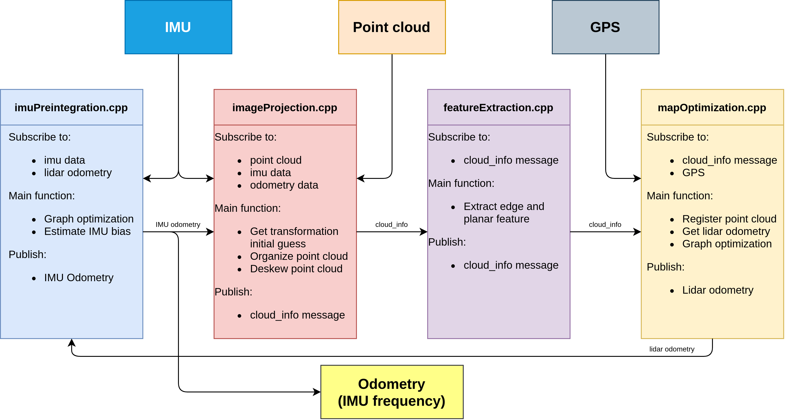

# lio-sam中的IMU标定总结

- lio-sam中使用IMU的方法分析
- lidar_align分析
- 使用lidar_align校准小车所使用ZED2中的IMU
- 实验结果

---

## 一、lio-sam中使用IMU的方法分析

---

## 二、lidar_align分析

lidar_align是一种激光雷达与IMU之间外部校准的方法。

https://github.com/ethz-asl/lidar_align

---

## 三、使用lidar_align校准小车所使用ZED2中的IMU

---

## 四、实验结果