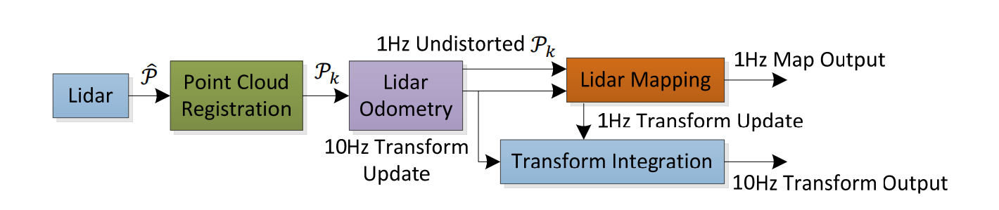
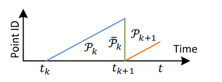
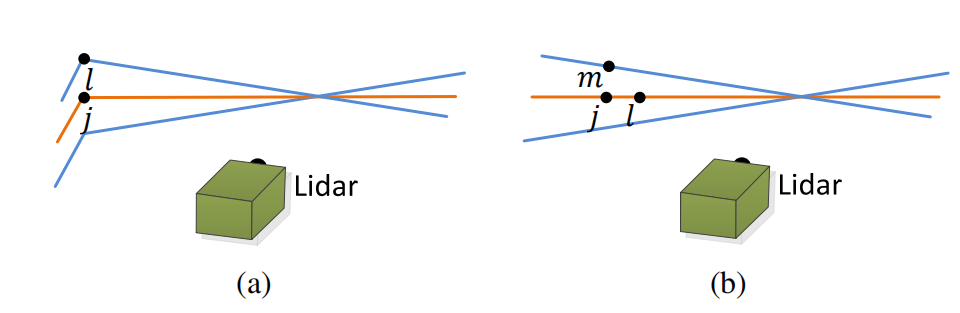

## 引言

3D映射仍然是一种流行的技术[1]–[3]。激光雷达的制图很常见，因为激光雷达可以提供高频范围的测量，而无论测量距离如何，误差都相对恒定。在激光雷达的唯一运动是旋转激光束的情况下，点云的对准很简单。但是，如果激光雷达本身像许多感兴趣的应用一样在移动，则精确的映射需要了解连续激光测距期间的激光雷达姿态。

解决该问题的一种常用方法是使用独立的位置估计（例如，通过GPS/INS）将激光点注册到固定坐标系中。另一组方法使用里程计测量，例如来自车轮编码器或视觉里程计系统[4]，[5]的记录激光点。

由于里程表会随着时间的推移整合较小的增量运动，因此里程表势必会漂移，因此会特别注意减少漂移（例如使用闭环）。

在这里，我们考虑使用以6自由度移动的2轴激光雷达创建具有低漂移测距法的地图的情况。使用激光雷达的主要优点是它对周围的环境光线和场景中的光学纹理不敏感。激光雷达的最新发展减小了其尺寸和重量。激光雷达可以由横穿环境的人握住[6]，甚至可以连接到微型飞机[7]。由于我们的方法旨在解决与里程计估计中的漂移最小化有关的问题，因此目前不涉及回路闭合。

该方法可实现低漂移和低计算复杂度，而无需高精度测距或惯性测量。获得这种性能水平的关键思想是同时定位和映射（SLAM）[8]这个典型的复杂问题的划分，该问题试图通过两种算法来同时优化大量变量。一种算法以高频率但低保真度执行测距法以估计激光雷达的速度。另一种算法以较低的数量级频率运行，以进行点云的精确匹配和配准。

尽管不是必需的，但如果有IMU，则可以提供先验运动来帮助说明高频运动。

具体来说，这两种算法都提取位于尖锐边缘和平面上的特征点，并将特征点分别与边缘线段和平面补丁匹配。

在里程计算法中，通过确保快速计算来找到特征点的对应关系。在映射算法中，通过关联的特征值和特征向量，通过检查局部点簇的几何分布来确定对应关系。

通过分解原始问题，更容易解决的问题是在线运动估计。之后，将映射作为批处理优化（类似于迭代最近点（ICP）方法[9]）进行操作，以生成高精度运动估计和映射。并行算法结构确保了实时解决问题的可行性。此外，由于以较高的频率进行运动估计，因此映射被给予足够的时间以增强准确性。

当以较低频率运行时，映射算法能够合并大量特征点，并使用足够多的迭代来收敛。

---

## 相关工作

激光雷达已经成为机器人导航中有用的距离传感器[10]。对于本地化和制图，大多数应用程序使用2D激光雷达[11]。当激光雷达的扫描速率高于其外在运动时，通常可以忽略扫描中的运动失真。在这种情况下，可以使用标准ICP方法[12]来匹配不同扫描之间的激光返回。
另外，提出了一种消除失真的两步法[13]：使用计算出的速度，在基于ICP的速度估计步骤之后进行失真补偿步骤。类似的技术也用于补偿单轴3D激光雷达[14]引起的失真。但是，如果扫描运动相对较慢，则运动失真会很严重。当使用2轴激光雷达时，尤其如此，因为一个轴通常比另一个轴慢得多。通常，其他传感器可用于提供速度测量，从而可以消除失真。例如，激光雷达云可以通过状态估计从与IMU集成的视觉里程计中注册[15]。当同时使用多个传感器（例如GPS/INS和车轮编码器）时，通常可以通过扩展的卡尔曼滤波器[16]或粒子过滤器[1]解决问题。这些方法可以实时创建地图，以帮助机器人导航中的路径规划和避免碰撞。

如果在不借助其他传感器的情况下使用2轴激光雷达，则运动估计和失真校正将成为一个问题。Barfoot等人使用的一种方法。通过激光强度返回创建视觉图像，并在图像之间匹配视觉上不同的特征[17]，以恢复地面车辆的运动[18]-[21]。在[18]，[19]中将车辆运动建模为恒定速度，在[20]，[21]中将模型建模为高斯过程。我们的方法使用与里程计算法中的[18]，[19]类似的线性运动模型，但是具有不同类型的特征。方法[18]–[21]涉及强度图像的视觉特征，并且需要密集点云。我们的方法提取并匹配笛卡尔空间中的几何特征，并且对云密度的要求较低。

最接近我们的方法是Bosse和Zlot[3]，[6]，[22]。他们使用2轴激光雷达获得点云，该点云通过匹配局部点簇的几何结构进行配准[22]。此外，他们使用多个2轴激光雷达来绘制地下矿山[3]。此方法合并了IMU，并使用闭环来创建大型地图。由同一作者提出的Zebedee是一种制图设备，由2D激光雷达和通过弹簧连接到手杆的IMU组成[6]。映射是通过手工点点设备进行的。通过批处理优化方法来恢复轨迹，该方法可以处理在分段之间添加边界约束的分段数据集。在这种方法中，IMU的测量值用于记录激光点，优化用于校正IMU偏差。本质上，Bosse和Zlot的方法需要批处理才能开发出准确的地图，因此不适用于需要实时地图的应用程序。相比之下，所提出的方法可以实时生成与Bosse和Zlot相似的地图。区别在于我们的方法可以为自动驾驶汽车的导航提供运动估计。此外，该方法利用了激光雷达扫描图案和点云分布。实现特征匹配，分别确保里程计和映射算法的计算速度和准确性。

---

## 注释和任务说明

本文解决的问题是利用3D激光雷达感知的点云执行自我运动估计，并为遍历的环境构建地图。 我们假设激光雷达已预先校准。我们还假设激光雷达的角速度和线性速度随时间推移是平滑且连续的，没有突变。 在VII-B节中，将通过使用IMU释放第二个假设。
作为本文的约定，我们使用右大写字母表示坐标系。 当激光雷达完成一次扫描范围时，我们定义了一次扫描。 我们使用权利订阅k，k∈Z +表示扫描，而Pk表示在扫描k期间感知到的点云。 让我们如下定义两个坐标系。

- 激光雷达坐标系{L}是3D坐标系，其原点位于激光雷达的几何中心。  x轴指向左侧，y轴指向上方，z轴指向前方。  {Lk}中点i，i∈Pk的坐标表示为XL（k，i）。
- 世界坐标系{W}是在初始位置与{L}一致的3D坐标系。  {Wk}中点i，i∈Pk的坐标为XW（k，i）。

有了假设和符号，我们的激光雷达测距和测绘问题可以定义为

问题：给定激光雷达云Pk的序列k∈Z +，计算每次扫掠k期间激光雷达的自我运动，并用Pk建立一个图 遍历的环境。

---

## 系统概述

### 硬件系统概述

### 软件系统概述

##### 图3.激光雷达测距和测绘软件系统的框图。

图3示出了软件系统的图。 令ˆP为激光扫描中收到的点。 在每次扫描期间，ˆP被注册在{L}中。 扫掠k期间的组合点云形成Pk。 然后，用两种算法处理Pk。

- 雷达里程计使用点云计算两次连续扫描之间的激光雷达运动。估计的运动用于校正Pk中的失真。该算法以大约10Hz的频率运行。
- 输出由激光雷达映射进一步处理，该激光雷达映射将未失真的云匹配并以1Hz的频率记录到地图上。

最后，将两种算法发布的姿态变换集成在一起，以生成相对于地图的激光雷达姿态约为10Hz的变换输出。 第五节和第六节详细介绍了软件图中的方框。

---

## 雷达里程计

### 特征点提取

我们首先从激光雷达云Pk中提取特征点。 图2所示的激光雷达自然会在Pk中生成不均匀分布的点。 激光扫描仪的返回在一次扫描中的分辨率为0.25◦。 这些点位于扫描平面上。 但是，由于激光扫描仪以180º/ s的角速度旋转并以40Hz的频率进行扫描，因此垂直于扫描平面的分辨率为180º/ 40 =4.5º。 考虑到这一事实，仅使用来自各个扫描的信息（具有共面几何关系）从Pk中提取特征点。

扫描中的点基于c值进行排序，然后选择特征点，其特征是最大c（即边缘点）和最小c（即平面点）。 为了在环境中均匀分布特征点，我们将扫描分为四个相同的子区域。 每个子区域最多可以提供2个边缘点和4个平面点。 仅当点i的c值大于或小于阈值且所选点的数量不超过最大值时，才可以将其选择为边或平面点。

### 特征点匹配

测距算法估计扫描中激光雷达的运动。 令tk为扫频k的开始时间。 在每次扫描结束时，在扫描过程中感知到的点云将Pk重新投影到时间戳tk + 1，如图6所示。

我们将重新投影的点云表示为Pk。 在下一个扫掠k + 1期间，¯Pk与新接收的点云Pk + 1一起用于估计激光雷达的运动。

##### fig 6. 将点云重新投影到扫描结束。 蓝色线段表示在扫描k Pk期间感知到的点云。 在扫描k结束时，将Pk重新投影到时间戳tk + 1，以获得Pk（绿色线段）。 然后，在扫描k + 1期间，共同使用Pk和新感知的点云Pk + 1（橙色线段）来估计激光雷达运动。

##### 找到一条边缘线作为E〜k + 1（a）中的一个边缘点的对应关系，并找到一个平面斑块作为〜Hk + 1（b）中的一个平面点的对应关系。在（a）和（b）中，j是最接近特征点的点，位于Pk中。 橙色线代表对j的相同扫描，蓝色线代表两个连续的扫描。 为了在（a）中找到边线对应关系，我们在蓝色线上找到另一个点l，并将对应关系表示为（j，l）。 为了在（b）中找到平面补丁对应关系，我们分别在橙色和蓝色线上找到另外两个点l和m。对应关系是（j，l，m）。

图7（a）表示找到边缘线作为边缘点的对应关系的过程。 设i为E〜k + 1中的一个点，i∈E〜k + 1。 边缘线由两点表示。

令j为Pk中i的最接近邻居，j∈Pk，而l为与j的两次连续扫描中i的最接近邻居。  （j，l）形成i的对应关系。 然后，为了验证j和l都是边缘点，我们基于（1）检查局部表面的光滑度。 在这里，我们特别要求j和l来自不同的扫描，因为单个扫描不能包含来自同一边缘线的多个点。 边缘线在扫描平面上只有一个例外。 但是，如果是这样，则边缘线将退化并在扫描平面上显示为直线，并且边缘线的特征点不应首先提取。

图7（b）示出了寻找平面补丁作为平面点的对应关系的过程。 设i为〜Hk + 1中的一个点，i∈〜Hk + 1。 平面斑块由三个点表示。

与最后一段相似，我们在Pk中找到i的最接近邻居，记为j。 然后，我们发现另外两个点l和m，它们是i的最接近邻居，一个点在j的相同扫描中，另一个在两次连续扫描中直至j的扫描。 这保证了这三个点是非共线的。 为了验证j，l和m均为平面点，我们基于（1）再次检查局部表面的光滑度。

### 运动估计

### 雷达里程计算法

激光雷达里程计算法显示在算法1。

该算法将最后一次扫描的点云Pk，当前扫描的增长点云Pk + 1和最后一次递归TLk + 1的姿态变换作为输入。

如果开始新的扫描，则TLk + 1设置为零（第4-6行）。 然后，该算法从Pk + 1中提取特征点，以在第7行中构造Ek + 1和Hk + 1。对于每个特征点，我们在Pk中找到它们的对应关系（第9-19行）。 运动估计适合于鲁棒拟合[27]。 在第15行中，算法为每个特征点分配双平方权重。 与它们的对应关系具有较大距离的特征点被分配较小的权重，而距离大于阈值的特征点被视为异常值并被分配零权重。 然后，在第16行中，将姿势转换形式更新一次迭代。 如果找到收敛或达到最大迭代次数，则非线性优化终止。 如果算法到达扫描结束，则使用扫描期间的估计运动将Pk + 1重新投影到时间戳tk + 2。 否则，仅返回变换TLk + 1进行下一轮递归。

---

## 实验