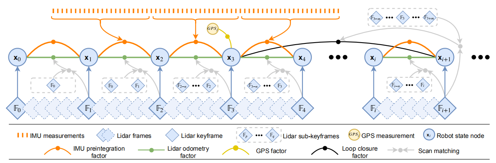

# LIO-SAM: Tightly-coupled Lidar Inertial Odometry via Smoothing and Mapping

## 摘要

我们提出了一个通过滤波和映射的LIO-SAM紧密耦合激光雷达惯性里程测量的框架，该框架可实现高精度，实时的移动机器人轨迹估计和地图构建。  LIO-SAM在因子图的顶部制定了激光雷达惯性里程表，从而可以将来自不同来源的大量相对和绝对测量值（包括回路闭合）作为因子合并到系统中。

来自惯性测量单元（IMU）预积分的估计运动使点云偏斜，并为激光雷达里程计优化提供了初始猜测。 获得的激光雷达里程计解决方案用于估计IMU的偏差。

为了确保实时高性能，我们将旧的激光雷达扫描边缘化以进行姿势优化，而不是将激光雷达扫描与全局地图匹配。 选择性地引入关键帧以及以有效的滑动窗口方法将新的关键帧注册到固定大小的先验集合中，在本地范围而不是全局范围内进行扫描匹配可显着提高系统的实时性能。  “子关键帧”。 在从不同规模和环境的三个平台收集的数据集上，对该方法进行了广泛的评估。

## 引言

状态估计，定位和映射是成功的智能移动机器人的基本先决条件，是反馈控制，避障和计划制定以及许多其他功能所必需的。 使用基于视觉和基于激光雷达的传感技术，已经做出了巨大的努力，以实现高性能的实时同时本地化和映射（SLAM），该支持可支持移动机器人的六个自由度状态估计。 基于视觉的方法通常使用单目或立体相机，并在连续图像中对特征进行三角测量以确定相机的运动。 尽管基于视觉的方法特别适合于位置识别，但是当它们单独用于支持自主导航系统时，它们对初始化，照明和范围的敏感性使其不可靠。 另一方面，基于激光雷达的方法在很大程度上不会改变光照。 特别是随着近距离远程高分辨率3D激光雷达（例如Velodyne VLS-128和Ouster OS1-128）的推出，激光雷达变得更适合直接捕获3D空间中环境的精细细节。 因此，本文重点研究基于激光雷达的状态估计和映射方法。

在过去的二十年中，已经提出了许多基于激光雷达的状态估计和映射方法。 其中，在文献[1]中提出的用于低漂移和实时状态估计和制图的激光雷达测距和制图（LOAM）方法是使用最广泛的方法。 使用激光雷达和惯性测量单元（IMU）的LOAM达到了最先进的性能，并且自从在KITTI里程表基准站点发布[2]以来，一直被评为基于顶级激光雷达的方法。 尽管取得了成功，但LOAM仍然存在一些局限性-通过将其数据保存在全局体素图中，通常很难执行闭环检测并合并其他绝对测量值（例如GPS）以进行姿势校正。 当此体素贴图在功能丰富的环境中变得密集时，其在线优化过程将变得效率较低。  LOAM在大规模测试中也存在偏差，因为它的核心是基于扫描匹配的方法。

在本文中，我们提出了一个通过平滑和映射LIO-SAM紧密耦合激光雷达惯性里程计的框架，以解决上述问题。 我们假设了点云偏斜的非线性运动模型，使用原始IMU测量来估计激光雷达扫描期间的传感器运动。 除了消除点云的偏斜外，估计的运动还可以作为激光雷达里程计优化的初始猜测。 然后，将获得的激光雷达里程计解决方案用于估计因子图中IMU的偏差。
通过引入用于机器人轨迹估计的全局因子图，我们可以使用激光雷达和IMU测量有效地执行传感器融合，在机器人姿态中合并位置识别，并在可用时引入绝对测量，例如GPS定位和指南针航向。 来自各种来源的因素集合用于图形的联合优化。 此外，我们将旧的激光雷达扫描边缘化以进行姿势优化，而不是将扫描匹配到像LOAM这样的全局地图。 局部匹配而不是全局匹配的扫描匹配显着提高了系统的实时性能，关键帧的选择性引入，以及将新关键帧注册到固定大小集的高效滑动窗口方法 之前的“子关键帧”。 我们工作的主要贡献可以概括如下：

- 在因子图上建立了紧密耦合的激光雷达惯性里程表框架，适用于多传感器融合和全局优化。
- 一种有效的，基于本地滑动窗口的扫描匹配方法，通过将选择性选择的新关键帧注册到一组固定大小的先前子关键帧中，可以实现实时性能。
- 所提议的框架通过各种规模，车辆和环境的测试得到了广泛验证。

##### 图1：LIO-SAM的系统结构。 该系统从3D激光雷达，IMU和GPS（可选）接收输入。 引入了四种类型的因子来构建因子图：（a）IMU预积分因子，（b）激光雷达测距因子，（c）GPS因子和（d）回路闭合因子。 这些因素的产生将在第三部分中讨论。

## 相关工作

激光雷达测距法通常是通过使用扫描匹配方法（例如ICP [3]和GICP [4]）找到两个连续帧之间的相对变换来执行的。 基于特征的匹配方法因其计算效率而不是匹配整个点云，因此已成为一种流行的替代方法。 例如，在[5]中，提出了一种基于平面的配准方法用于实时激光雷达测距。 假设在结构化环境中进行操作，它将从点云中提取平面，并通过解决最小二乘问题来匹配它们。 在文献[6]中提出了一种基于领线的方法，用于里程计估计。 在这种方法中，线段是从原始点云中随机生成的，以后用于配准。 但是，由于现代3D激光雷达的旋转机制和传感器运动，扫描的点云经常会偏斜。 仅使用激光雷达进行姿势估计并不理想，因为使用偏斜点云或特征进行配准最终会导致较大的漂移。

因此，激光雷达通常与其他传感器（例如IMU和GPS）结合使用，以进行状态估计和映射。 利用传感器融合的这种设计方案通常可以分为两类：松耦合融合和紧密耦合融合。 在LOAM [1]中，引入了IMU以使激光雷达扫描偏斜，并在进行扫描匹配之前先进行运动。 但是，IMU不参与算法的优化过程。 因此，LOAM可以归为松散耦合方法。 在[7]中提出了一种用于地面车辆测绘任务的轻量级和地面优化的激光雷达测距和制图（LeGO LOAM）方法[8]。  IMU测量值的融合与LOAM相同。 松耦合融合的一种更流行的方法是使用扩展卡尔曼滤波器（EKF）。 例如，[9] [13]在机器人状态估计的优化阶段使用EKF集成了来自激光雷达，IMU和可选GPS的测量值。

以紧密耦合的方式递归递归。 由于缺少用于状态估计的其他可用传感器，因此在长时间导航期间会发生漂移。 文献[17]中介绍了紧密耦合的激光雷达惯性里程表和测绘框架LIOM。  LIOM是LIO-mapping的缩写，与LOAM相比，可共同优化激光雷达和IMU的测量，并获得相似或更好的精度。 由于LIOM被设计为处理所有传感器测量，因此无法实现实时性能-在我们的测试中，它的运行速度约为0.6倍。

## 通过滤波和映射的雷达惯性里程计

## 实验

数据集是使用地面无人车（Clearpath Jackal）在植被覆盖的公园内收集的。

通过将传感器安装在船上并在阿姆斯特丹的运河中巡游，收集了最后一个数据集，即阿姆斯特丹。

这些数据集的详细信息显示在表1中。

##### 表1