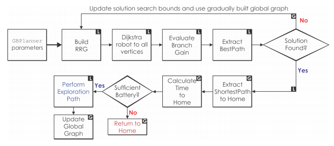

# Graph-based Path Planning for Autonomous Robotic Exploration in Subterranean Environments

地下环境中自主机器人探索的基于图的路径规划

## 摘要

本文提出了一种新的策略，用于在地下伊朗环境中基于自治图的勘探路径规划。 考虑到地下环境（例如地下矿井）通常是狭窄的隧道状和多分支拓扑的大型网络，建议的规划师围绕本地和全球规划师的分叉架构而构建。 本地计划者使用快速探索的随机图来可靠，有效地识别无冲突路径，从而优化本地子空间内的探索增益。 考虑到机器人的耐用性限制以及本地计划程序到达死角的可能性（例如，采矿方向），当必须确定返回原路或重新定位机器人时，将使用全局计划程序 朝向探索空间的边缘。 拟议的规划师在美国和瑞士的现役和废弃地下矿山内的部署中进行了现场评估。

---

## 引言

自主机器人的探索和制图正在扩展到在民用和军事领域中越来越多的应用程序集。 例如，空中机器人目前被用于多种监视枪[1]，工业检查[2、3]，搜索和救援[4、5]以及商业应用[6]。 然而，对于机器人进入和弹性自治，各种环境仍然特别具有挑战性。 特别是，在这项工作中，我们重点关注地下环境中的自主勘探和制图问题。 地下世界的特点是具有一系列特性，这些特性使自动航空机器人很难做到这一点，包括以下事实：它们通常非常长且规模很大，尤其是狭窄且受限，自相似，感知退化和通信匮乏， 而它们通常还具有崎and而动态的地形。 尽管存在这些重大挑战，但地下机器人自治的好处在整个应用领域和行业中都非常重要。 在地下矿井内紧急情况下进行地雷救援的机器人，地下大都市基础设施（例如地铁，下水道）的检查，在地球和太空中的洞穴和熔岩管内的探索任务都是相关应用的指示性领域。

在感知退化的环境中对空中机器人进行制图[7-10]，并以认识地下环境特殊性的方式关注自主探索路径规划问题。 我们提出了一个新的基于图的探索路径规划器（GBPlanner），该规划器采用了针对地下应用程序域的量身定制的局部和全局规划架构。 本地计划器在当前机器人位置附近的有限体积内操作，并采用快速探索的随机图采样内核来评估机器人路径，以最大化与探索更多未映射体积有关的信息增益。 选择最佳路径，以使信息增益最大化，然后由机器人执行。 当本地计划者报告无法识别提供重要信息增益的路径时（例如，当机器人处于诸如矿井掘进等死角时）或电池电量不足时，将执行全局计划步骤并负责有效地进行 规划到机器人的归位位置或到探索空间先前感知到的边缘（例如未访问的分支）的路径。 经确定，这种基于分叉抽样的方案能够确保对大型，狭窄，隧道状和多分支地下环境进行有效而稳健的勘探。

在数十个使用航空机器人的野外实验中，对在地下环境中进行有效勘探路径规划的方法进行了评估，包括在美国和瑞士的活跃矿井和非活跃矿井中进行的测试。 更具体地说，来自以下任务的现场测试结果与以下任务有关：a）美国活跃金矿的开发水平中的自主长期勘探； b）废弃的，特别狭窄的地下内部的勘探和自动归位 瑞士的铁矿。

 
本文的其余部分结构如下：第二节介绍相关工作，然后在第三节中陈述问题。 建议的方法在第IV节中进行了详细说明，而评估研究则在第V和VI节中进行了介绍。 最后，在第七节中得出结论。

---

## 相关工作

丰富的工作集中在勘探路径规划的一般问题上[11-21]。 早期的工作包括对“下一个最佳视图”的采样[19]，以及基于前沿的探索[20]。 最近的工作提出了降低水平的多目标规划[16、17、22、23]，多机器人方法[24、25]，并强调了广泛的野外工作[18、26]。

 
但是，在大多数这些努力中，所考虑的勘探问题并未反映出地下环境的特殊性。 通常，现有的规划方法主要用于处理室外区域或相对较小的结构化设施。 这两种情况都没有反映出非常大规模的，类似隧道的，多分支的，狭窄的和广泛复杂的地下环境（例如矿山，洞穴网络，地铁基础设施）所面临的挑战。

 
针对这些事实，一个利基社区研究了针对地下爆炸问题的定制解决方案。  [27，28]中的工作提出了基于边缘探索和相交检测的地下环境拓扑探索方法。 已通过Groundhog系统在地面平台上进行了验证，可提供开创性的勘探能力。  [29–32]中的工作强调了在几何约束环境中的运动计划，尽管并未专门针对地下领域。 从系统的角度来看，[33，34]中的工作概述了地面和潜水式地下机器人技术的技术创新。 本文提出的贡献旨在通过提供有效和解决方案的分叉方法，在本质上提供一个通用的，但在设计，路径规划方法方面进行优化的自主地下勘探方法，该方法针对体积增益进行了优化，并结合了局部规划策略。 具有全局计划层，负责确保机器人的自主归位操作以及在机器人到达死角（例如，掘进方向）后将其重新定位在未知空间附近。 该系统已通过空中机器人在大量地下矿井中进行了广泛的现场测试，而其算法设计使其也可用于其他涉及具有隧道状走廊和分支点的大规模，几何约束环境的勘探问题。

---

## 问题陈述

The exploration path planning problem, as considered in this work, is that of autonomously exploring and mapping an initially unknown space that broadly belongs to the class of subterranean environments. 
这项工作中考虑的探索路径规划问题是自主探索和绘制最初属于未知空间的问题，该空间大致上属于地下环境类别。

Such settings (e.g. underground mines, tunnels, and cave networks) present key challenges and inner structure that must be accounted for. Namely, that a) they are often of very large-scale, and b) their traversable space is constrained from the surrounding geometry in a tunnel-like topology consisting of tube-like structures and
branching points. 
这样的环境（例如地下矿山，隧道和洞穴网络）提出了关键挑战和必须考虑的内部结构。即，（a.它们的规模通常是非常大的），并且（b.在由管状结构和分支点组成的隧道状拓扑结构中，它们的可穿越空间受到周围几何形状的限制。）。 

The first observation prohibits the planning problem from taking place in a computationally efficient manner at the full scale of the environment bounds. 
第一个观察结果阻止在整个环境规模下以计算有效的方式进行规划问题。 

However, the latter observation provides a noticeable characteristic that the planning algorithm may exploit; focusing the exploration on iteratively updated local sub-spaces generates a potentially large exploration reward without the penalty of exhaustively searching through the whole space. 
然而，后一种观察提供了规划算法可以利用的显著特征；将探索集中在迭代更新的局部子空间上，可以产生非常好的潜在探索效果，而不必对整个空间进行彻底搜索。

This insight allows us to re-cast the exploration path planning problem into two bifurcated stages, namely that of the local planner responsible for efficient exploration within a spatial window around the current robot pose, and that of the global planner which is responsible for a) autonomous homing, and b) re-positioning of the robot to the edge of the exploration space when the local planner reports completion of its local search potential.
这种见解使我们可以将探索路径规划问题重新划分为两个分阶段，即负责在当前机器人姿态周围的空间窗口内进行有效探索的局部规划器，以及负责（a.自主归位）和（b.当局部规划器报告完成其局部潜在搜索后，将机器人重新放置在探索空间的边缘）的全局规划器。

Let M be a 3D occupancy map of the environment that is incrementally built from observations of an onboard depth sensor S. The map consists of voxels m of three categories, namely m ∈ M_free, m ∈ M_occupied, or m ∈ M_unknown representing free, occupied, and unknown space respectively.
设M为根据车载深度传感器s的观测结果逐步构建的环境的三维占用图，该地图由三种类型的体素M组成，即M∈M_free、M∈M_occupanted或M∈M_unknown，分别表示空闲空间、占用空间和未知空间。

Furthermore, let dmax be the maximum effective range of the depth sensor S. 
设dmax为深度传感器S的最大有效范围。

In addition, let the robot’s configuration at time t be defined as the combination of 3D position and heading ξ_t = [x_t, y_t, z_t, ψ_t]. 
将机器人在t时刻的配置定义为3D位置和航向的组合ξ_t = [x_t, y_t, z_t, ψ_t]。

Furthermore, since for most range sensors’ perception stops at surfaces, sometimes hollow spaces or narrow pockets cannot be fully explored thus leading to a residual map M_∗,res ⊂ M_unknown with volume V_∗,res which is infeasible to explore given the robot’s constraints. 
此外，由于大多数距离传感器的感知停止在表面，有时空洞的空间或狭窄的口袋受机器人的限制而不能完全探索，从而导致剩余地图 M_∗,res ⊂ M_unknown，体素V_∗,res。

As a result, given a volume V_∗, the potential volume to be explored is V_∗,explored = V_∗\V_∗,res. 
因此，给定体素V_∗，需要被探索的潜在体素是V_∗,explored = V_∗\V_∗,res.

Therefore, we define the concepts of “local completion” and “global completion” for the local and global planners respectively.
我们分别为局部和全局规划定义了“局部完成”和“全局完成”的概念

- Problem 1 (Local Planner) 

Given an occupancy map M and a local subset of it ML centered around the current robot configuration ξ0, find a collision-free path σL = {ξi} to guide the robot towards unmapped areas and maximize an exploration gain defined as the volume which is expected to be mapped when the robot traverses along the path σL with a sensor S. When “local completion” is reported by this planner, the global planner is to be engaged.
给定以当前机器人配置ξ_0为中心的占用地图M及其局部子集M_L，找到一条无碰撞路径σ_L={ξi}，引导机器人走向未映射区域，并最大化探测增益，即当机器人与传感器S沿路径σ_L移动时，预期要绘制的体积。当该规划器报告“局部完成”时，将启用全局规划器。

- Problem 2 (Global Planner) 

Given an occupancy map M of the environment and the current robot configuration ξ0, find a collision-free path σG leading the robot towards unmapped areas. Feasible paths of this planning problem must take into account the remaining endurance of the robot. When the environment is explored completely (“global completion”) or the battery limits are approaching, find a collision-free path σH to return the robot to its home location ξhome.
给定环境占据地图M和当前机器人位姿ξ0，找到一条无碰撞路径σ_G，引导机器人走向未映射区域。该规划问题的可行路径必须考虑机器人的剩余动力。当环境完全探索（“全局完成”）或界区接近时，找到一条无碰撞路径σH，使机器人返回其原点ξhome。

---

## 提出方法

本节概述了提出的基于图的规划。

A.结构概述

地下环境通常由具有多个分支点和较长的几何约束漂移的狭窄隧道网络的超大规模组合组成。

Excellent examples include those of underground mines, metropolitan subway infrastructure, and cave networks. In response to these facts, an appropriate planning strategy must be able to provide fast and efficient solutions for volumetric exploration despite the large-scale and geometricallyconstrained character of such environments, while simultaneously offering a) safe return-to-home functionality, and b) solution resourcefulness when the exploration process reaches a dead-end (e.g. a mine heading). Such a solution is proposed and structured in the local and global planner architecture detailed below and outlined in Figure 2.
出色的例子包括地下矿山，大都市地铁基础设施和洞穴网络。 针对这些事实，尽管此类环境具有大规模且受几何约束的特征，但适当的规划策略必须能够为大批量勘探提供快速有效的解决方案，同时又可以提供
a）安全的返还给 家庭功能；
以及
b.)当勘探过程达到死胡同时（例如，矿井顶端），有丰富的解决方案。

在下面详细介绍并在图2中概述的本地和全局规划器体系结构中提出并构造了这种解决方案。

##### Fig.2 提出的规划器结构。字母“L”表示作为局部规划器的一部分（尽管它们被全局层重新利用）。标有字母“G”的块与全局规划器相关（例如，与自动归位操作相关）。

Both the local and global planning layers are built based on sampling-based rapidly-exploring random graph search, a choice that reflects notable features of underground environments (e.g. mines) including the fact that they are undirected and potentially include cycles.
局部和全局规划层都是基于基于采样的快速探索随机图搜索构建的，该选择反映了地下环境（例如矿山）的显着特征，包括其无方向性并可能包含循环的实际情况。

B.局部规划器

为适应复杂、大规模、多分支地下环境长期勘探的需要，局部规划器是所提出方法的核心，通过利用快速探索随机图算法[35，RRG]，确保机器人根据地下环境的几何结构发展出有效的探索行为。

---

## 基于仿真的评估

为了在实验验证之前评估和调整建议的基于图的勘探计划器，在像环境这样的大型地下矿井中进行了模拟研究。 使用RotorS Simulator [40]，进行了一项研究，将本地计划器设置为在尺寸为长×宽×高= 40×40×4m的DL滑动窗口和长×宽的机器人包围盒DR中操作 ×高度= 1.5×1.5×0.5m。 探索速度设置为1m / s。 该测试如图3所示，不受实际机器人的耐用性限制，可以调整GBPlanner的参数并验证本地计划程序的操作以及自动归位和重新定位功能。

---

## 试验评估

然后，就其在现实生活中复杂的地下环境中实现快速，高效和鲁棒的勘探自主性的能力，对所提出的基于图的勘探计划器进行了实验验证。 特别是，两个不同的地下金属矿被用作现场测试地点。

第一个是内华达州Winnemucca的Turquoise Ridge合资企业（TRJV）地下矿山，这是一座现代且活跃的金矿，地下层很深（例如1,300ft，1,500ft和1,700ft的深度），并且漂移很长 。 第二个是位于Switzer土地的Sargans的Gonzen矿，这是1966年废弃的老铁矿。每一个矿都具有独特的特征和挑战。  TRJV地雷代表了一个非常大规模的环境，具有现代化的，相对宽敞的（〜4m宽），但漂移和航向非常长，而且结构高度井井有条，其感测条件通常由于灰尘而大大降低。  Gonzen矿山包括较窄的矿山巷道（通常小于3m宽）和相对较不规则的分支点。 两种环境都代表了地下机器人的指示性案例，所提出的测试是在进行中的DARPA地下挑战赛的准备框架内进行的[41]。

所有提出的实验都是使用围绕DJI Matrice M100开发的自动航空机器人进行的，该机器人集成了多模式传感器融合解决方案以及松散耦合的LiDAR里程表和制图以及视觉惯性定位。 该系统依靠模型预测控制（MPC）进行自动化操作，GBBlanner订阅由本地化和制图解决方案提供的数据，并提供对板载MPC的引用。 整个系统解决方案的详细信息可以在[7、9、10、42]中找到，而系统概览如图4所示。值得注意的是，集成的深度传感器S是Velodyne PuckLITE，可提供水平和垂直视场 FH = 360°，FV = 30°。 它的最大范围为100m，而地图的更新发生在前50m的范围内。 基于机器人的大小和安全考虑，将所有测试的边界框DR设置为长×宽×高= 1.4×1.4×0.5m。

在第一次野外实验中，对拟议中的计划运行进行评估，研究了TRJV矿（地下1,300英尺）的“开发”水平。 仅向机器人提供要探索的总体积的总边界DG，而将本地计划器VL的滑动窗口设置为长×宽×高= 40×40×4m的边界框DL。 设置名义飞行速度为0.5m / s，在起飞演习后立即使用规划器，并通过本地规划器的迭代步骤，机器人探查了如图5所示的两个矿山漂移。整个任务已经完成。 在完全自主模式下。 从描绘的结果可以看出，勘探路径主要遵循矿山的总体结构，在机载LiDAR单元的水平视场为360°的情况下，直觉上也是有效的解决方案。 当需要计划者处理矿山拓扑中的点时，那里的小子空间（小杂物间和设备存储区）提供分支点，但体积勘探的潜力很小，因此计划的路径会受益于方向性偏差并保持较高的水平 勘探率着眼于主要漂移。 有关此任务的视频，请访问https://youtu.be/VWgEVTeABdE。

在第二个野外实验中，将Gonzen矿区的一部分分配给计划者进行勘探。 与先前的实验类似，只为机器人提供了大致的探索范围，并且将本地计划器的滑动窗口再次设置为长×宽×高= 40×40×4m。 由于该实验的明确目标是评估自主归位功能并同时在狭窄的环境中推动机器人的探索前沿，因此探索速度设置为0.75m / s，但返航速度设置为1m / s  。 图6描述了相关结果。

最后，图7显示了有关这些地下测绘任务重建质量的更多说明性图像。 如图所示，重要的结构细节可以被识别，而车载视觉系统进一步支持对地下环境的理解。 这些结果证明了拟议的计划程序能够在复杂的现实地下环境中实现高性能的自主勘探行为。 遵循我们先前工作的传统[16、17、23]，GBPlanner将向社区开源。

---

## 结论

在这项工作中，提出并演示了适合地下勘探任务的基于图的路径规划器。 规划人员可以在大规模，多分支和类似隧道的狭窄环境中有效地引导机器人。

该算法采用两阶段的本地和全局规划器体系结构，其中本地规划器可提高勘探效率，而全局规划器可提供返回家园和拓扑重新定位功能。 使用空中机器人在地下矿山中进行现场加固后，未来的工作将涉及在许多地下环境中进行现场评估和验证，其中还包括使用空中和地面平台的洞穴网络和地铁基础设施。

---

---