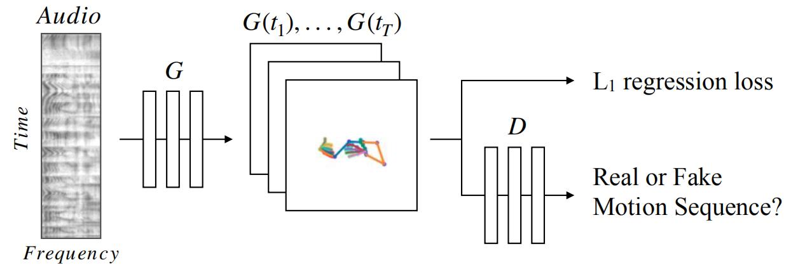
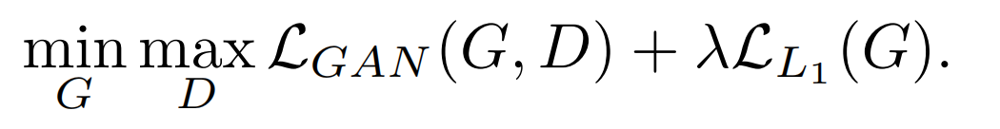

## 4.方法  
&emsp;&emsp;给定原始的演讲语音，我们的目标是生成演讲者的相应手臂和手势动作。我们分两个阶段来处理此任务。

&emsp;&emsp;首先，由于我们训练的唯一信号是相应的音频和姿势检测序列，因此我们使用L1回归到2D关键点时间堆栈来学习从语音到手势的映射。

&emsp;&emsp;其次，为了避免回归所有可能的手势模式，我们采用了对抗判别器，以确保我们产生的动作相对于说话者的典型动作是合理的。

#### 语音到手势翻译  
&emsp;&emsp;任何现实的手势动作必须在时间上连贯且流畅。我们通过学习表示整个语音的音频编码，考虑输入语音 **s** 的整个时间范围并一次（而不是周期性地）预测相应姿势 **p** 的整个时间序列，来实现平滑。

###### &emsp;&emsp;语音到手势翻译模型。卷积音频编码器对2D频谱图进行下采样并将其转换为1D信号。然后，转换模型 **G** 预测2D姿势的相应时态堆栈。L1回归到地面真相姿势可提供训练信号，而对抗性判别器 **D** 可确保预测的运动在时间上是连贯的，并且具有说话者的风格。

&emsp;&emsp;整个卷积网络，由一个音频编码器和一个1D UNet翻译架构组成，如图所示。音频编码器采用2D对数-梅尔频谱图作为输入，并通过一系列卷积对其进行下采样，从而产生与视频采样率相同的1D信号(15 Hz)。

&emsp;&emsp;UNet翻译架构随后通过L1回归损失学会将该信号映射到手势向量的时间堆栈。（有关手势表示的详细信息，请参见第3节）：  

&emsp;&emsp;之所以使用UNet架构进行翻译，是因为它的瓶颈为网络提供了过去和未来的时间上下文，允许高频时间信息流过，从而能够预测快速的手势运动。

#### 预测合理的运动
&emsp;&emsp;虽然L1回归是从数据中提取训练信号的唯一方法，但它存在回归均值的已知问题，这种回归均值会产生过度平滑的运动。为了解决这个问题，添加了一个以预测的姿态序列的差异为条件对抗性鉴别器 **D**。

&emsp;&emsp;即，鉴别器的输入是向量m = [p2-p1,......,pT-pT-1]，其中pi是2D姿势关键点，**T** 是输入音频和预测姿势序列的时间范围。鉴别符 **D** 试图使随后的目标最大化，而生成器 **G** （翻译体系结构，第4.1节）则试图使其最小化。

&emsp;&emsp;其中 **s** 是输入音频语音片段，**m** 是预测的姿势堆栈的运动导数。因此，发生器学习产生说话者的真实运动，而鉴别器学习对给定运动序列是否真实进行分类。因此，我们的全部目标是

#### 实施细节  
&emsp;&emsp;我们通过从伪地面真相手势表示中的所有其他关键点减去（每帧）颈部关键点位置来获得平移不变性（第3节）。然后，我们通过减去每个发言人的均值并除以标准差，对所有帧中的每个关键点（例如左手腕）进行标准化。在训练过程中，我们将对应于约4秒钟音频的频谱图作为输入，并预测64个姿态矢量，这对应于15Hz帧频下的约4秒。在测试时，我们可以在任意音频持续时间内运行网络。我们使用Adam [23]优化了该方法，批处理大小为32，学习率为10 4。我们分别训练有300K / 90K的迭代，且没有对抗损失，并在验证集上选择最佳的成型模型。
