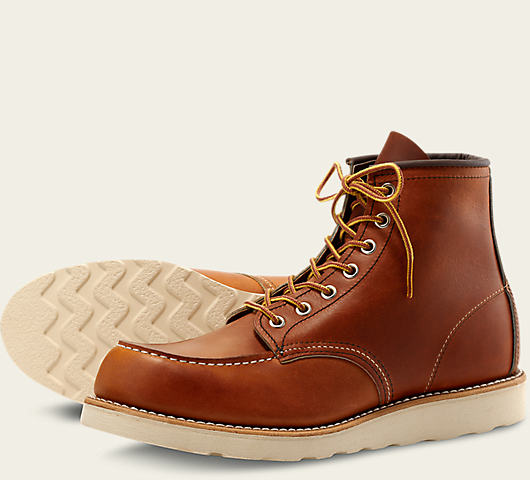

### 8111褐

### 8113翻毛皮土黄

### 8114黑(★★★)

### 8119酒红(★★★★)

### 8012樱桃红(★★★★★)

[日本乐天 8012](http://www.imaijp.jp/auc/aucCategory?cid=0&sort=5&offset=&date=20200711&site_id=yahoo&query=redwing+8012&store=0&sellerId=&item_status=0&aucminprice=&aucmaxprice=&txt_gotopage=&easy_auc_cid=1)

---

### 875/10875/9875/8875

#### 新版875(不带钢印，皮质偏软，颜色发红)

#### 老版875(带钢印，皮质偏软，颜色发黄)

#### 10875(带钢印，皮质偏硬，深褐色)

#### 9875黄狗橘黄色

#### 8875红色(★★★)

---

#### 8875与8131对比

- 8875是透染，里外全红，8131不是透染，里侧皮子是棕色。
- 光从外观颜色看。8875红的更正。8131红里偏一点棕黄
- 皮质上8875更厚更润，摸着油蜡油蜡的。

综上，8875>8131

#### 9876

---

### 9874黑狗(★★★★)

特点：茶芯

旧化效果：

新：

---

### 8882(★★★)

---