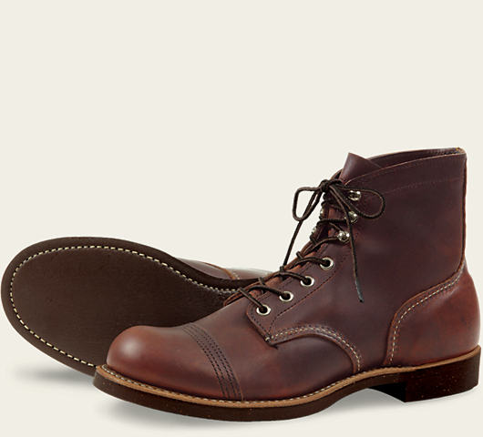

### 8882(★★★★★)

比8859更蓝

### 8859

---

### 8119(★★★★★)

酒红色

### 8111

---

### 875/10875/9875/8875

#### 新版875(不带钢印，皮质偏软，颜色发红)

#### 老版875(带钢印，皮质偏软，颜色发黄)

#### 10875(带钢印，皮质偏硬，深褐色)

#### 9875黄狗橘黄色

#### 8875红色

---

### 8131

#### 8131与8875对比

- 8131不是透染，里侧皮子是棕色，8875是透染，里外全红。
- 光从外观颜色看。8875红的更正。8131红里偏一点棕黄
- 皮质上8875更厚更润，摸着油蜡油蜡的。

8875>8131

---

### 9874黑狗(★★★★★)

特点：茶芯

旧化效果：

新：

---

