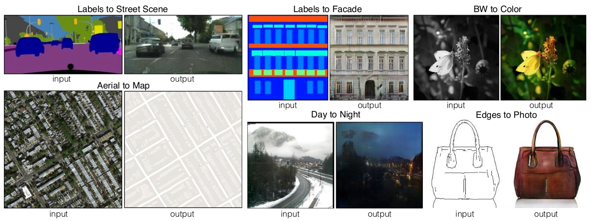
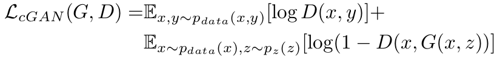
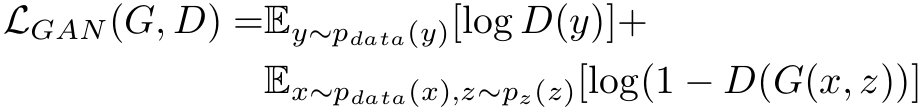
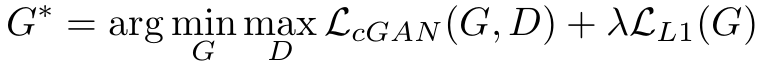
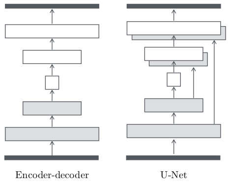

## 摘要

　　我们研究条件对抗网络作为图像到图像翻译问题的通用解决方案。

　　这些网络不仅学习从输入图像到输出图像的映射，而且学习损失函数来训练该映射。

　　这使得可以将相同的通用方法应用于传统上需要非常不同的损失公式的问题。

　　我们证明了这种方法可以有效地从标签图合成照片，从边缘图重建对象以及为图像着色等任务。 作为一个社区，我们不再需要手工设计映射功能，这项工作表明我们无需手工设计损失函数就可以取得合理的结果。

---

##### 图1：图像处理，图形和视觉方面的许多问题都涉及将输入图像转换为相应的输出图像。 即使设置始终相同，也通常使用特定于应用程序的算法来解决这些问题：将像素映射到像素。 条件对抗网络是一种通用解决方案，似乎可以很好地解决这些问题。 这里我们展示几种方法的结果。 在每种情况下，我们都使用相同的体系结构和目标，并且仅对不同的数据进行训练。

## 引言
 
　　图像处理，计算机图形学和计算机视觉中的许多问题都可被视为将输入图像“转换”为相应的输出图像。

　　正如可以用英语或法语表达概念一样，可以将场景渲染为RGB图像，梯度场，边缘图，语义标签图等。

　　与自动语言翻译类似，我们将自动图像到图像翻译定义为在给定足够的训练数据的情况下将场景的一种可能表示转换为另一种场景的问题（参见图1）。

　　语言翻译困难的一个原因是，语言之间的映射很少一对一映射，因此任何给定的概念都比另一种语言更易于表达。

　　同样，大多数图像到图像的翻译问题要么是多对一（计算机视觉）-将照片映射到边缘，片段或语义标签，要么是一对多（计算机图形）-映射标签或用户输入稀疏到逼真的图像。

　　传统上，这些任务中的每一项都是由单独的专用机器（例如[7、15、11、1、3、37、21、26、9、42、46]）处理的，尽管始终相同：根据像素预测像素。本文的目标是为所有这些问题开发一个通用框架。

## 相关工作

##### 图像建模的结构化损失

　　图像到图像的转换问题通常被表示为按像素分类或回归[26、42、17、23、46]。 从每个输出像素在条件上被认为独立于给定输入图像的所有其他像素来看，这些公式将输出空间视为“非结构化”。 相反，有条件的GAN会学习结构性损失。 结构性损失会损害输出的联合配置。 大量文献都考虑了这种损失，其流行方法包括条件随机字段[2]，SSIM度量[40]，特征匹配[6]，非参数损失[24]，卷积伪先验[41]。 ，以及基于匹配协方差统计数据的损失[19]。 我们的条件GAN的不同之处在于可以学习损失，并且从理论上讲可以惩罚输出和目标之间不同的任何可能结构。

##### 条件GAN

　　我们不是第一个在条件设置中应用GAN的。以前的作品已经将GAN设置在离散标签[28]，文本[32]以及图像上。图像条件模型解决了修复问题[29]，根据法线图进行图像预测[39]，受用户约束条件引导的图像处理[49]，未来帧预测[27]，未来状态预测[48]，产品照片生成[ 43]，以及样式转移[25]。这些方法中的每一种都是针对特定应用量身定制的。我们的框架的不同之处在于，没有什么是特定于应用程序的。这使我们的设置比大多数其他设置简单得多。
我们的方法在生成器和鉴别器的几种体系结构选择上也不同于这些先前的工作。与过去的工作不同，对于我们的生成器，我们使用基于“ U-Net”的体系结构[34]，对于我们的鉴别器，我们使用卷积的“ PatchGAN”分类器，该分类器仅在图像补丁范围内惩罚结构。先前在[25]中提出了类似的PatchGAN架构，以获取本地样式统计信息。在这里，我们证明了这种方法对更广泛的问题有效，并且我们研究了更改补丁大小的影响。

---

## 方法

### 目的

条件GAN的目标可以被表示为：

G试图将这个目标最小化，而对抗者D则试图将其最大化，即 
G∗= arg minG maxD LcGAN (G, D)

为了测试条件判别器的重要性，我们还与不遵守x的无条件变量的判别器进行了比较：

以前的cGAN的方法已经发现，将GAN目标与更传统的损失（例如L2距离）混合是有益的[29]。 

鉴别器的工作保持不变，但是生成器的任务不仅是欺骗鉴别器，而且还要使它接近L2意义上的地面真相输出。 

我们还探索了此选项，使用L1距离而不是L2，因为L1鼓励减少模糊：
.png)

我们最终的目标是：

没有z，网络仍然可以学习从x到y的映射，但是会产生确定性的输出，并因此无法匹配除增量函数以外的任何分布。

过去的条件GAN都已经意识到了这一点，并提供了高斯噪声z作为生成器除了x之外 的输入（例如[39]）。

在最初的实验中，我们没有发现这种策略有效（生成器只是学会了忽略噪声），这与Mathieu等人的观点一致。 [27]。

取而代之的是，对于最终模型，我们仅以dropout的形式提供噪声，并在训练和测试时将其应用于发生器的多个层。

尽管有噪声，但我们的网络输出中观察到的随机性很小。

设计产生随机输出的条件GAN，从而捕获它们建模的条件分布的全部熵，是当前工作遗留的一个重要问题。

### 网络结构

我们从[30]中的生成器和鉴别器体系结构中进行调整。 生成器和鉴别器都使用 convolution-BatchNorm-ReLu [18]形式的模块。
附录中提供了该体系结构的详细信息，下面讨论了一些关键功能：

#### 跳跃生成器

图像到图像转换问题的定义特征是它们将高分辨率输入网格映射到高分辨率输出网格。

另外，对于我们考虑的问题，输入和输出的表面外观不同，但是两者都是相同基础结构的绘制。

因此，输入中的结构与输出中的结构大致对齐。

我们围绕这些考虑因素设计生成器体系结构。

针对该领域中的问题的许多先前解决方案[29、39、19、48、43]已经使用了编码器-解码器网络[16]。

在这样的网络中，输入将通过一系列逐渐递减采样的层，直到成为瓶颈层为止，在这一点上，过程将被逆转（图3）。

例如，在图像着色的情况下，输入和输出共享突出边缘的位置。

对于许多图像翻译问题，在输入和输出之间共享大量低级信息，因此希望将这些信息直接穿梭在网络上。

例如，在图像着色的情况下，输入和输出共享突出边缘的位置。

为了给生成器一种避免此类信息瓶颈的方法，我们按照“ U-Net”的一般形状添加了跳过连接[34]（图3）。

具体来说，我们在第i层和第n-i层之间添加跳过连接，其中n是总层数。每个跳过连接仅将第i层的所有通道与第n-i层的通道连接在一起。

##### 图3：生成器架构的两个选择。 “ U-Net” [34]是一种编码器-解码器，在编码器和解码器堆栈的镜像层之间具有跳过连接。

#### 马尔可夫鉴别器(PatchGAN)

众所周知，L2损失（以及L1，见图4）会在图像生成问题上产生模糊的结果[22]。

尽管这些损失不能促进高频脆性(highfrequency crispness)，但在许多情况下，它们仍然可以准确地捕获低频。

对于这种情况下的问题，我们不需要全新的框架即可在低频下增强正确性。 L1已经可以了。

这激励了将GAN鉴别器限制为仅对高频结构进行建模，这依赖于L1项来强制进行低频正确性（公式4）。

为了建模高频，将我们的注意力集中在局部图像补丁中的结构上就足够了。

因此，我们设计了一个鉴别器架构（我们称之为PatchGAN），该架构只会对补丁规模的结构进行惩罚。

该鉴别器尝试对图像中的每个N×N色块是真实的还是假的进行分类。

我们对图像进行卷积运算，对所有响应求平均以提供D的最终输出。

在第3.4节中，我们证明N可以比图像的整个尺寸小得多，并且仍然可以产生高质量的结果。

这是有利的，因为较小的PatchGAN具有较少的参数，运行速度更快，并且可以应用于任意大的图像。

这样的鉴别器有效地将图像建模为马尔可夫随机场，假设相隔大于补丁直径的像素之间具有独立性。

这种联系先前在[25]中进行了探讨，也是纹理[8，12]和样式[7，15，13，24]模型中的常见假设。

因此，我们的PatchGAN可以理解为一种纹理/样式丢失的形式。

#### 优化和推论

为了优化我们的网络，我们遵循[14]中的标准方法：在D的一个梯度下降步骤与G的一个步骤之间交替。

我们使用minibatch SGD并应用Adam求解器[20]。

在推论时，我们以与训练阶段完全相同的方式运行生成器网络。

这与通常的协议不同，在于我们在测试时应用dropout，并且我们使用测试batch的统计信息而不是训练batch的统计信息应用批标准化[18]。

当batch size设置为1时，这种批标准化的方法被称为“实例标准化”，并已被证明在图像生成任务中是有效的[38]。

在我们的实验中，我们将batch size 1用于某些实验，将batch size 4用于其他实验，注意这两个条件之间的差异很小。

---

## 实验

---

## 附录

### 网络结构

我们根据[30]中的内容调整网络架构。
有关模型的代码，请访问https://github.com/phillipi/pix2pix。
令Ck表示具有k个滤波器的Convolution-BatchNorm-ReLU层。 CDk表示Convolution-BatchNorm-Dropout-ReLU层，其丢失率为50％。 所有卷积均为4×4空间滤波器，步幅为2。编码器和鉴别器中的卷积以2的系数下采样，而在解码器中，以2的系数上采样。

#### 生成器结构

编解码器架构包括：

编码器：
C64-C128-C256-C512-C512-C512-C512-C512

解码器：
CD512-CD512-CD512-C512-C512-C256-C128-C64

在解码器的最后一层之后，使用卷积映射到输出通道的数量（除着色外，一般为3，为2），然后是Tanh函数。 除上述标记外，批处理规范不适用于编码器中的第一个C64层。
编码器中的所有ReLU都leaky，slope为0.2，而解码器中的ReLU则不leaky。
除了编码器中的第i层与解码器中的第n-i层之间的跳过连接外，U-Net架构是相同的，其中n是总层数。 跳过连接将激活从第i层连接到第n-i层。 这会更改解码器中的通道数：

U-Net解码器：
CD512-CD1024-CD1024-C1024-C1024-C512-C256-C128

---