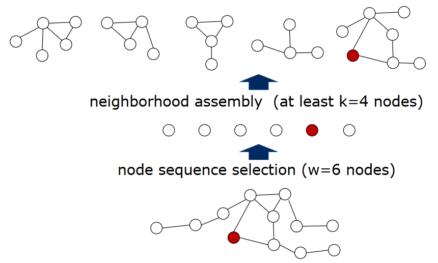
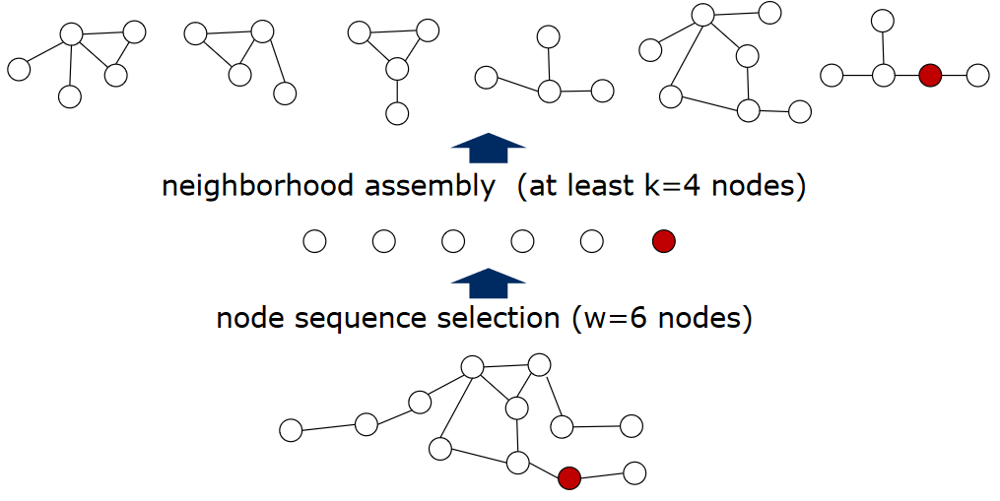

### 图神经网络
普通的图结构上如果使用邻接矩阵（Adjacency matrix）来定义邻域时，每个节点的邻域中节点的数量并不是固定的（传统结构中，考虑补 0 时，图像上像素附近的像素是总是固定的）。

这就使得我们我们很难确定： 
1）需要使用的卷积核的参数维度；
2）如何排列权重矩阵与邻域内的节点以进行内积运算。

在原始的 GCN 文章中，作者提出了将内积操作变为这样一个操作：使用同一个向量与所有邻域内的点上的特征向量计算内积并将结果求均值。
这使得： 
1）卷积核的参数可以确定为一个固定长度的向量；
2）不需要考虑邻域内节点的顺序。

### 节点序列选择

选择W个节点来代表整个图进行卷积

#### 方法
中心化方法：计算每个节点与其他所有节点之间的距离，然后排序

### 邻节点收集

确定感受野（receptive filed）大小，确定感受野，确定感受野中节点顺序

对于w个节点，按距离选择包括自己在内至少k个节点（如果所有距离1的邻节点不够，就扩充到所有距离2的节点），得到候选集

### 规范化

按照中心化算距离的方法，从候选集中得到最终的感受野，并排序确定顺序

### 提取特征

