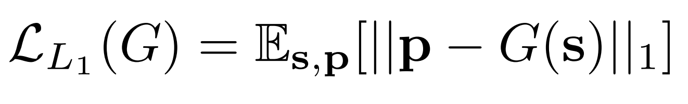
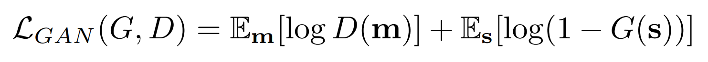

## 实现方法

　　给定原始语音语音，我们的目标是生成扬声器的相应手臂和手势动作。 我们分两个阶段来完成这项任务-首先，由于训练所需的唯一信号是相应的音频和姿势检测序列，因此我们使用L 1回归2D关键点的时间堆栈来学习从语音到手势的映射。 其次，为了避免回归所有可能的手势模式，我们采用了对抗性鉴别器，以确保我们产生的运动相对于说话者的典型运动是合理的。

###### 　　图3：语音到手势转换模型。 卷积音频编码器对2D频谱图进行下采样并将其转换为1D信号。 然后，转换模型G预测2D姿势的相应时间堆栈。 L 1回归基本事实姿势可提供训练信号，而对抗性鉴别器D可确保预测的运动在时间上既连贯又符合说话者的风格。

### 1、语音到手势翻译

　　任何逼真的手势动作必须在时间上连贯且流畅。 我们通过学习代表整个话语的音频编码来实现平滑，同时考虑到输入语音s的整个时间范围，并一次（而不是周期性地）预测相应姿势p的整个时间序列。 

　　我们的全卷积网络由一个音频编码器和一个一维UNet [39，22]转换架构组成，如图3所示。音频编码器将2D对数梅尔频谱图作为输入，并通过一系列卷积对它进行下采样， 导致一维信号具有与我们的视频相同的采样率（15 Hz）。 然后，UNet转换体系结构学会通过L 1回归损失将此信号映射到姿势向量的时间堆栈（请参见第3节，了解我们的手势表示的详细信息）：

　　我们使用UNet架构进行翻译，因为其瓶颈为网络提供了过去和将来的时间上下文，而跳跃连接则允许高频时间信息通过，从而可以预测快速运动。

### 2、预测合理的运动

　　虽然L1回归是从数据中提取训练信号的唯一方法，但它存在回归均值的已知问题，这种回归均值会产生过度平滑的运动。为了解决这个问题，添加了一个以预测的姿态序列的差异为条件的**对抗鉴别器D**。

　　即，鉴别器的输入是向量m = [ p[2] - p[1] , ... , p[T] - p[T-1] ]，其中p[i]是2D姿势关键点，**T** 是输入音频和预测姿势序列的时间范围。鉴别符 **D** 试图使下式结果最大化，而生成器 **G** （翻译体系结构，第4.1节）则试图使其最小化。

###### 　　其中 **s** 是输入音频语音片段，**m** 是预测的姿势堆栈的运动导数。

　　因此，生成器学习产生说话者的真实动作，而鉴别器学习对给定的动作序列是否真实进行分类。因此，我们的全部目标是

### 3、实施细节

　　我们通过从伪真实姿势表示中的所有其他关键点减去（每帧）颈部关键点位置来获得平移不变性（第3节）。然后，我们通过减去每个发言人的均值并除以标准差，对所有帧中的每个关键点（例如左手腕）进行标准化。

　　在训练过程中，我们将对应于约4秒钟音频的频谱图作为输入，并预测64个姿态矢量，这对应于15Hz帧率下的4.266667秒，约4秒。

　　在测试时，我们可以运行网络在任意时长的音频内。

　　我们使用Adam[(Adam：随机优化方法)](https://arxiv.org/pdf/1412.6980.pdf)进行了优化，batch size大小为32，learning rate为0.0001。

　　我们在有对抗损失和没有对抗损失上，分别迭代训练300K和90K次，并选择在验证集上性能最好的模型。
