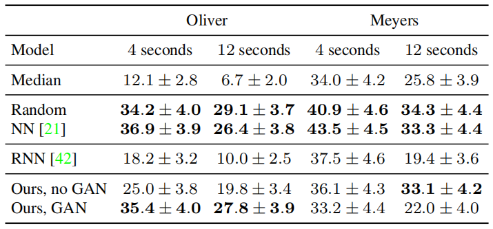
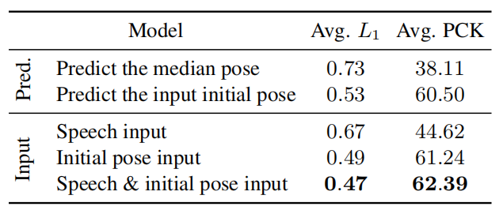

## 5.1 设定  
#### 5.1.1 基准线
我们将我们的方法与其他几种模型进行比较。
##### 总是预测中位姿势
演讲者大部分时间都处于休息位置[22]，因此预测演讲者的中位姿势可以作为高质量的基线。有关每个扬声器的静止位置的外观，请参见图2。
##### 预测随机选择的手势
在此基准中，我们从同一说话者的训练集中随机选择一个不同的手势序列（与输入话语不对应），并将其用作我们的预测。尽管我们不希望这种方法在量化上表现良好，但是有理由认为它会产生质感诱人的动作：这是真实的说话人手势，要告诉他们是假的，唯一的方法就是评估其对应的效果。音频。
##### 最近邻
代替从同一说话者选择完全随机的手势序列，我们可以将音频用作相似提示。对于输入音频轨道，我们使用预训练的音频功能找到与扬声器最近的邻居，并传递其相应的运动。为了表示音频，我们使用在AudioSet [17]上预先训练的最新VGGish功能嵌入[20]，并在归一化功能上使用余弦距离。
##### RNN
我们进一步将运动预测与Shlizerman等人提出的RNN架构进行比较。与我们类似，Shlizerman等。从2D骨骼关键点空间中的音频预测手臂和手部动作。但是，尽管我们的模型是带有对数-梅尔频谱图输入的卷积神经网络，但他们的模型使用的是1层LSTM模型，该模型采用MFCC特征（低维，手工制作的音频特征表示）作为输入。我们评估了这两种特征类型，发现对于[37]，MFCC特征在所有说话者上的表现均优于对数mel频谱图特征。因此，我们在实验中使用它们的原始MFCC功能。为了与我们自己的模型保持一致，我们没有像在PCA要素上那样测量L2距离，而是添加了额外的隐藏层并使用L1距离。
##### 我们的，没有GAN
最后，作为消融，我们将完整模型与单独的翻译体系结构的预测进行了比较，而没有对抗性鉴别器。
#### 5.1.2 评估指标
我们主要的量化评估指标是比较不同模型的L1回归损失。我们另外根据正确关键点（PCK）的百分比报告结果[42]，这是一种广泛接受的姿势检测指标。在此，如果预测的关键点落在地面真实关键点的αmax（h，w）个像素之内，则定义为正确，其中h和w分别是人员边界框的高度和宽度。我们将PCK值看得一清二楚，因为它并不是针对部分可见说话者的手势预测而设计的。首先，与L1不同，PCK不是线性的，并且正确性评分在硬阈值之外降至零。由于我们的目标不是预测地面真实运动，而是将其用作训练信号，因此L1更适合衡量我们的平均表现。其次，PCK对较大的手势动作敏感，因为正确半径取决于讲话者手臂的跨度。第三，对人的边界框的依赖引入了人为的敏感性，即每个人在框架中显示了多少，以及他们是坐着还是站着。虽然[42]建议对于有完整人员的数据，α= 0.1，对于只有一半人可见的数据，α= 0.2，但我们对α= 0.1，0.2取平均值，并在补充资料中显示完整结果。

## 5.2 定量评估

我们使用定量指标将方法的结果与基线进行比较。为了评估我们的结果是否令人信​​服，我们进行了一项用户研究。
最后，我们询问所预测的手势是否是特定于人的，并且输入语音是否确实比手势的初始姿势更好地预测运动

#### 5.2.1 定性结果
我们将每个说话者在2,048个随机选择的测试集间隔上与所有基线进行比较，并将结果显示在表1中。
我们看到，在大多数扬声器上，我们的模型都优于其他所有扬声器，在这种情况下，我们的无GAN条件略好于GAN。 这是预料之中的，因为对抗性区分器会推动生成器捕捉到数据的单一模式，该模式通常比实际地面真实情况更远，而不是单独优化L1损失所预测的平均值。 在大多数扬声器上，我们的模型优于基于RNN的模型。 定性地，我们发现该基线预测了我们数据的相对较小运动，这可能是由于与UNet模型相比，该数据具有相对较低的容量。

##### 在测试集上使用L1损失（越低越好）的语音到手势翻译任务的定量结果。 最右边的列是所有发言人的平均PCK值（越高越好），并且α= 0.1、0.2（请参阅完整结果补充）。

#### 5.2.2 用户欺骗研究
为了深入了解合成手势在感知上与真实运动的比较，我们在Amazon Mechanical Turk上进行了小规模的真实与假想知觉研究。我们使用了两个始终从同一摄像机视角拍摄的发言者：奥利弗（Oliver）（其手势相对动态）和迈耶斯（Meyers），（其相对静止）。 我们使用骨骼线帧的视频对手势运动进行可视化。
为了给参与者提供更多的背景信息，我们在视频中加入了说话者真实的嘴部和面部关键点。 我们在视频补充材料中显示了骨骼线框视频的示例。

参与者观看了一系列视频对。在每对视频中，一个是根据真实的姿势序列制作的一个视频，另一个是由算法（我们的模型或基线）生成的。然后，要求参与者区分与语音相对应的动作的视频（我们没有验证他们在回答问题时确实听了语音）。 显示了4秒钟或12秒钟的视频，每个分辨率为400×226（从910×512向下采样，以便在不同的屏幕尺寸上并排显示两个视频），每对视频后，参与者都获得了无限制的响应时间 。 我们随机采样了100个输入音频间隔，并使用每种方法从中预测了2D关键点运动序列。 每个任务包括20对视频，由300个不同的参与者执行。 在开始任务之前，对每位参与者进行了简短的10组视频对训练，并获得了反馈，表明他们是否正确区分了真实动作。

我们比较了所有手势预测模型（第5.1.1节），并使用其输出欺骗参与者的比率评估了每种方法的质量。 有趣的是，我们发现对于动态发言者而言，所有产生逼真的运动的方法都以相似的比例欺骗了人类。如表2所示，无论是通过基于音频的最近邻方法还是随机选择的，我们针对该发言者的结果与真实的运动序列相当。 对于将大部分时间都处在静止位置的发言者，由于没有与之相关的预测误差，因此经常选择真实动作。 尽管最接近的邻居和随机运动模型在定量上的准确性明显较低（表1），但它们在感知上令人信服，因为它们的组成是真实的。

##### 表2：在两个发言者的4和12秒视频剪辑上进行语音到手势翻译任务的人体研究结果-一个动态（Oliver）和一个相对静止的（Meyers）。 作为比较的指标，我们使用参与者被生成的动作欺骗的次数的百分比，并在两种选择的强制选择中，将他们选为真实的真实动作。 我们发现人类对语音和手势的对齐不敏感。 对于动态说话者，具有逼真的动作的手势（无论是从同一说话者的另一个视频中随机选择还是由我们基于GAN的模型生成的手势）均以相同的比率欺骗人类（黑体数字之间在统计学上没有显着差异）。 由于固定发言者通常处于静止位置，因此真实的未对齐运动序列看起来更逼真，因为它们不会像生成的动作序列那样受到预测噪声的影响。

#### 5.2.3 预测特定者的手势
对于每个演讲者的语音输入（图4行），我们将使用所有其他演讲者训练有素的模型预测手势（图4列）。 我们发现，平均而言，使用在其他扬声器上训练的模型进行数字预测比在预测随机运动上的数字效果更好，但比始终预测输入扬声器的中位姿势要差得多（并且远比根据在模型上训练的模型的预测差） 输入扬声器）。 图4中混淆矩阵的对角线结构对此进行了举例说明。

#### 5.2.4 语音是手势的良好预测指标
看到我们转换模型的成功后，我们想知道，当手势序列的初始姿势已知时，音频信号有多少帮助。换句话说，声音能告诉我们多少超越运动规律所能预测的东西。 为了对此进行研究，我们通过在讲话之前直接提供讲话者的姿势来扩展我们的模型，该模型被纳入UNet的瓶颈中（图3）。

我们考虑以下情况：

- 像上面的基线中那样预测中间姿势。

- 预测输入的初始姿势，该模型只是重复输入初始的真实姿势作为其预测。

- 语音输入，我们之前的模型。

- 初始手势输入，这是我们模型的一种变体，其中消融了音频，并且网络根据（1）仅初始真实手势输入；或（2）语音及初始手势输入，来预测手势，其中我们将预测条件设置为语音和初始手势。

表3显示了在没有对抗性鉴别器（无GAN）的情况下训练的模型的比较结果。 在比较“仅初始姿势输入”和“语音及初始姿势输入”时，我们发现，当我们平均所有讲话者的损失时，使用语音添加会大大提高准确性（使用双侧t分布检验，p<10^3）。

有趣的是，我们发现大多数收益来自少数演讲者（例如oliver），他们在演讲过程中会做大动作。

##### 表3：一旦我们知道说话者的初始姿势，声音会提供多少信息？ 我们看到，手势序列的初始姿势对于4秒运动序列的其余部分（倒数第二行）是一个很好的预测器，但是添加音频可以改善预测（最后一行）。 我们将所有扬声器的平均L1损耗（越低越好）和平均PCK都使用，并且α= 0.1、0.2（越高越好）作为比较指标。 我们比较两个基准和三个输入条件。

## 5.3 定性结果

我们定性地比较语音和手势转换结果与图5中的基线和地面真相手势序列。请参阅补充视频结果，它可以更好地传达时间信息。

# 6 结论

人类通过视觉和声音进行交流，但是这些方式之间的联系仍然不清楚[23]。 在本文中，我们提出了从“狂野”语音中预测特定于人的手势的任务，作为研究这些沟通渠道之间联系的一种计算手段。 我们创建了一个针对特定人群的视频数据集，并使用该数据集训练了一个模型来预测语音手势。 在实验评估中，我们的模型优于其他方法。
尽管在这些任务上表现出色，但我们的模型仍存在局限性，可以通过结合其他工作来解决。 例如，与使用文本转录作为音频相比，使用音频具有其优势，因为音频是一种丰富的表示形式，其中包含有关韵律，语调，节奏，音调等的信息。 但是，音频不会直接编码高级语言的语义，这可能使我们可以预测某些类型的手势（例如，隐喻），也不会将讲话者的讲话与其他声音（例如，听众的笑声）区分开。 此外，我们将姿势估计视为真实情况，会引入大量噪声，尤其是在说话者的手指上。
我们认为我们的工作是朝对话手势的计算分析迈出的一步，并为进一步研究打开了三个可能的方向。 第一个是使用手势作为视频分析的表示形式：同语音手势和手臂动作自然成为视频预测任务的目标。
第二种是使用野外手势作为训练对话代理的方法：我们基于GAN [10]提出了一种可视化手势预测的可视化方法，但遵循经典工作[8]，这些方法 预测还可以用于驱动虚拟代理的运动。 最后，我们的方法是从音频预测运动的少数少数尝试之一。跨模态翻译任务是进一步研究的沃土。

