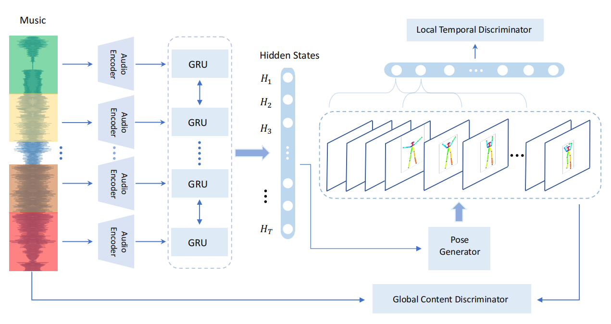
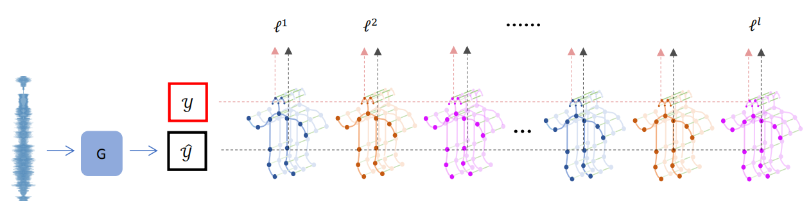

## 3.概述

为了从音乐中产生舞蹈视频，我们将系统分为两个阶段。在第一阶段，我们提出了一个端到端模型，该模型根据音频输入直接生成舞蹈骨架序列。在第二阶段，我们应用改进的pix2pixHD GAN，将舞蹈骨架序列转移到舞蹈视频中。在本概述中，我们将主要描述第一阶段，如图2所示。

##### 图2：我们的人类骨架序列合成框架。输入是音乐信号，分为0.1秒的音乐。该生成器包含一个音频编码器，一个双向GRU和一个姿态生成器。生成器的输出骨架序列与音乐一起被馈送到全局内容鉴别器。然后将生成的骨架序列划分为重叠的子序列，这些子序列被馈送到局部时间区分符中。

令V为人体骨骼的关节数，二维坐标（x，y）的维数为2。我们将舞蹈骨骼序列X表示为总共T个连续帧中的人体骨骼序列：，其中每个骨架是一个包含所有（x，y）关节位置的向量。我们的目标是学习函数，该函数将每帧采样率S的音频信号映射到联合位置矢量序列。

### 生成器

生成器由音乐编码部分和姿势生成器组成。 输入的音频信号分为0.1秒的音乐片段。 这些片段使用一维卷积进行编码，然后按时间顺序输入到双向2层GRU中，从而导致输出隐藏状态。 这些隐藏的状态被输入到姿势生成器中，该姿势生成器是一个多层感知器，用于生成骨架序列X。

### 局部时间判别器

输出的骨架序列X分为K个重叠序列∈R t×2V。 然后将这些子序列输入到本地时间鉴别器，它是一个两分支卷积网络。 最后，一个小的分类器输出K个分数，这些分数确定了这些骨架子序列的真实性。

### 全局内容判别器

全局内容鉴别器的输入包括音乐M∈R T S和舞蹈骨架序列X。对于姿势部分，使用姿势鉴别器将骨架序列X编码为F P∈R 256。 对于音乐部分，类似于生成器的子网，使用一维卷积对音乐进行编码，然后将其输入到双向2层GRU中，从而得到输出和OM被传送到[22]的自我注意组件中，以获得综合的音乐特征表达FM∈R 256。 最后，我们沿着通道将F M和F P连接起来，并使用一个由1D卷积层和完全连接（FC）层组成的小型分类器来确定骨架序列是否与音乐匹配。

### 姿势感知损失

最近，由于人类骨骼结构是图结构数据，因此图卷积网络（GCN）已扩展到模型骨架。 因此，GCN提取的特征仍然是不同身体部位之间的高级空间结构信息。 与传统方法（例如L1距离和L2距离）相比，预训练的GCN网络中的匹配激活对姿势的细节和布局都提供了更好的约束。 图3显示了姿势感知损失的流水线。 由于姿势感知损失，我们的输出骨架序列不需要额外的平滑步骤或任何其他后处理。

##### 图3：基于ST-GCN的姿势感知损失概述。是第一阶段的生成器。是真实骨架序列，而是生成的骨架序列。
