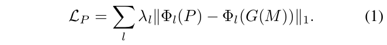

## 4. Pose Perceptual Loss（姿势感知损失）

感知损失或特征匹配损失[2、8、11、15、27、39、40]是衡量图像处理和合成中两个图像之间相似度的常见损失。 对于生成人体骨骼序列[3、19、35]的任务，只有L 1或L 2距离用于测量姿势相似性。 在损失L 1或L 2的情况下，我们发现我们的模型倾向于保守地（重复地）生成姿势，并且无法正确捕获整个运动的语义关系。 而且，OpenPose [4、5、42]生成的数据集非常嘈杂，如图5所示。在大量视频上校正不正确的人体姿势是费力的，并且是不希望的：使用10 FPS的两分钟视频会 有1200个姿势可以验证。 为了解决这些困难，我们提出了一种新颖的姿势感知损失。

##### 图5：由遮挡和重叠引起的嘈杂数据。 对于K-pop数据集的第一部分，存在大量此类骨骼。 对于K-pop数据集的第二部分，几乎没有不正确的骨骼。

感知损失的概念最初是在图像领域研究的，用于匹配视觉感知网络（如VGG-19）中的激活[32，8]。要使用传统的知觉损失，我们需要在图像上绘制生成的骨架，这很复杂，而且看似次优。代替将姿势关节坐标投影到图像，我们建议直接将姿势识别网络中的激活与人类骨骼序列作为输入进行匹配。这样的网络主要针对姿势识别或预测任务，ST-GCN [44]是图卷积网络（GCN），适用于我们的案例中的视觉感知网络。 ST-GCN利用时空图来形成骨架序列的分层表示，并且能够从数据中自动学习时空模式。为了测试姿势感知损失对我们的嘈杂数据集的影响，我们准备了一个20视频数据集，该数据集由于OpenPose姿势检测错误而产生许多噪声。如图4所示，我们的生成器可以稳定地生成具有姿势感知损失的姿势。

##### 图4：在每个部分中，第一幅图像是由模型生成的没有姿势感知损失的骨骼，而第二幅图像是由模型生成的有姿势感知损失的骨骼（根据同一首音乐）。

给定一个预训练的GCN网络，我们将层的集合定义为。 对于训练对的集合定义为)，其中P是地面真实骨骼序列，M是相应的音乐，我们的感知损失为

在这里，是我们框架中的第一阶段生成器。 超参数平衡每一层对损耗的贡献。
