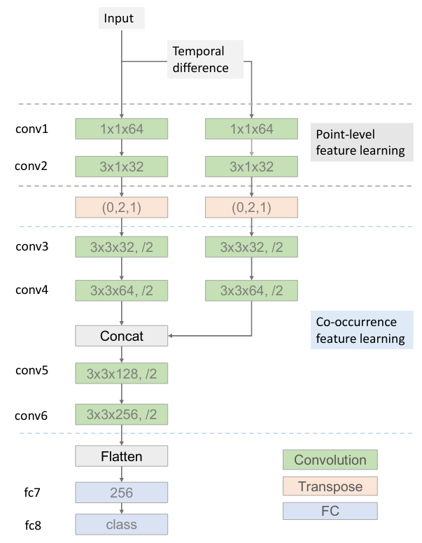

## 5.1 姿势判别器

为了评价一个骨架序列是否是一个优秀的舞蹈，我们认为最重要的是联合：
- 出现的帧内表示
- 骨架时间演化的帧间表示。

为了提取姿势序列的特征，我们探索了基于多流CNN的方法，并采用Hierarchical Co-occurrence分层式共现网络（HCN）框架[20]，使鉴别器能够区分真假姿势序列。

### Two-Stream CNN

姿势鉴别器的输入是一个骨架序列X，将时序差分插值为X的同一形状，然后将骨架序列和时序差分作为两个输入流直接送入网络。通过沿通道串联的方法对特征映射进行融合，然后利用卷积层和全连通层来提取特征。

##### 分层共现网络，绿色块是卷积层，最后一个维度表示输出通道的数量。后面的“/2”意味着在卷积之后附加了步长为2的MaxPooling层。Transpose层根据序参量排列输入张量的维数。在conv1、conv5、conv6和fc7之后附加了ReLU激活函数，以引入非线性。

---

## 5.2 局部时间判别器

姿势生成器的目标之一是生成的骨骼序列的时间相关性。例如，当一个男人移动他的左脚时，他的右脚应该在多帧中保持静止。与PatchGAN[14，47，40]相似，我们建议使用局部时间鉴别器，它是PatchGAN的1D版本，以实现连续帧之间的一致性。此外，局部时间鉴别器包含一个修剪姿势鉴别器和一个小分类器。

---

## 5.3 全局内容判别器

舞蹈与音乐有着密切的联系，音乐与舞蹈的和谐是评价一个舞蹈序列的重要标准。受[38]的启发，我们提出了全局内容鉴别器来处理音乐和舞蹈之间的关系。

正如我们前面提到的，音乐被编码成一个序列omm={h1m，h2m，…，htm}。尽管GRU可以捕获长期的依赖关系，但对GRU来说，对整个音乐信息进行编码仍然是一个挑战。在我们的实验中，只使用H-T-M来表示音乐特征F-M会导致骨架序列的起始部分崩溃。因此，我们使用自我注意机制[22]为每个隐藏状态分配一个权重，从而获得一个全面的嵌入。在下一部分中，我们将简要描述框架中使用的自我注意机制。

### Self-attention机制

给定om∈rt×k，我们可以通过

---

## 5.4 其他损失函数

GAN loss L_adv。局部时间判别器（D_local）训练在重叠的骨架序列上，这些重叠骨架序列使用S（·）从整个骨架序列中采样。
全局内容判别器（D Global）区分骨架序列与输入音乐m之间的协调性。此外，我们有x=G（m）和基本真骨架序列p。我们还在D全局中应用了梯度惩罚项[13]。因此，对抗性损失定义为

L 1距离L_L1，给定一个X∈rt×2V形状相同的基真舞蹈骨架序列Y，在关节级的重建损失为：

特征匹配损失lfm，我们采用[39]中的特征匹配损失来稳定全局内容鉴别器D的训练：

---

## 5.5 Pose to Video

第三方实现：

https://github.com/CUHKSZ-TQL/EverybodyDanceNow_reproduce_pytorch