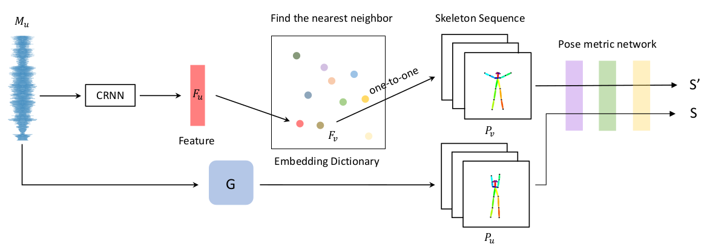

## 6.实验

### 6.1 数据集

### 6.2 实验步骤

### 6.3 评估

我们将评估以下基准和模型。

- L1。在这种情况下，我们仅使用L 1距离来导通发电机。
- 全局D。基于L 1，我们添加一个全局内容区分符。
- 局部D。基于全局D，我们添加了本地时间区分符。
- 我们的模型。 基于局部D，我们添加姿势感知损失。 这些条件在表2中使用。

#### 6.3.1 用户研究

为了评估生成的骨架序列的质量（我们的主要贡献），我们进行了一项用户研究，比较了合成骨架序列和真实的骨架序列。 我们随机采样10对不同长度的序列，并将其绘制成视频。
为了使这项研究公平，我们验证了地面真实情况的骨架并重新标注了嘈杂的骨架。 在用户研究中，每个参与者都以随机顺序观看合成骨架序列的视频和地面真实骨架序列的视频。 然后，参与者需要选择以下两个选项之一：1）第一个视频效果更好。  2）第二个视频更好。 如图7所示，在43.0％的比较中，参与者投票赞成我们合成的骨架序列。 这项用户研究表明，我们的模型可以与真实艺术家在相似的水平上编排舞蹈。

#### 6.3.2 跨模态评估

评估舞蹈序列是否适合某首乐曲具有挑战性。 据我们所知，目前尚无评估音乐和舞蹈之间映射的方法。 因此，我们提出了两步跨模态度量，如图8所示，以估计音乐和舞蹈之间的相似性。
给定训练集X = {（P，M）}，其中P是舞蹈骨架序列，M是相应的音乐。 然后，使用经过预训练的音乐特征提取器E m [9]，我们将所有音乐嵌入F = {E m（M），M∈X}汇总到嵌入字典中。
我们评估的输入是音乐M u。 使用我们的生成器G，我们可以获得合成的骨架序列P u = G（M u）。 第一步是找到代表音乐M u的骨架序列。 我们首先通过F u = E m（M u）获得音乐特征F u。 然后令F v为嵌入字典中F u的最接近邻居。 最后，我们使用其相应的骨架序列P v表示音乐M u。 第二步是使用Coskun等人提出的基于三重态架构和最大均值差异的新颖度量学习目标，测量两个骨架序列之间的相似性。  [10]。 有关此指标的更多实施细节将在补充材料中显示。

##### 图8：跨模式评估。 我们首先将K-pop数据集的训练集中的所有音乐作品投影到嵌入词典中。 我们基于嵌入字典的K-means聚类结果训练姿势度量网络。对于K均值聚类，我们根据剪影系数选择K = 5。  M u和P u之间的相似性通过kS-S 0 k 2来衡量。

#### 6.3.3 定量评估

为了评估与其他条件相比最终方法的结果质量，Chan等人。  [7]建议在同一视频之间进行传输，因为没有用于合成帧的参考，并使用SSIM [41]和LPIPS [45]来测量视频。 对于我们的任务，这样的指标没有用，因为生成的舞蹈视频没有参考帧。 因此，我们使用BRISQUE [26]（一种无参考图像质量评估）来衡量最终生成的舞蹈视频的质量。
如表2所示，通过使用全局内容鉴别器和本地时间鉴别器，即使对于单帧结果，得分也更好。 对于姿势感知损失的增加，姿势变得合理，然后将各种姿势转移到帧可能会导致得分下降。 此外，在我们的视频中可以观察到更大的差异。 为了验证我们提出的评估，我们还尝试了两个随机条件：

