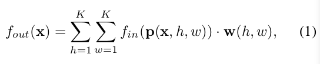
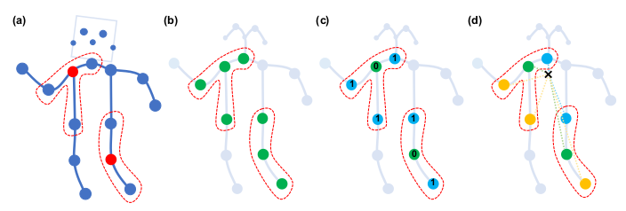

## 3. 时空图卷积网络

在进行活动时，人体关节会以局部局部运动，称为“身体部位”。 现有的基于骨骼的动作识别方法已经验证了在建模中引入身体部位的有效性（Shahroudy等人2016; Liu等人2016; Zhang，Liu和Xiao 2017）。
我们认为，这种改进主要是由于与整个骨骼相比，零件限制了“局部区域”内关节轨迹的建模，因此形成了骨骼序列的层次表示。 在诸如图像对象识别之类的任务中，通常通过卷积神经网络的固有属性（Krizhevsky，Sutskever和Hinton 2012）实现分层表示和局部性，而不是手动分配对象部分。 它促使我们将CNN的吸引力引入到基于骨架的动作识别中。 尝试的结果是ST-GCN模型。

### 3.1 通道概述

基于骨骼的数据可以从运动捕捉设备或视频的姿态估计算法中获得。通常来说，数据是一系列的帧，每一帧都有一组关节坐标。给定 2D 或 3D 坐标系下的身体关节序列，我们就能构造一个时空图。其中，人体关节对应图的节点，人体身体结构的连通性和时间上的连通性对应图的两类边。因此，ST-GCN 的输入是图节点的关节坐标向量。这可以被认为是一个基于图像的 CNN 模拟，其中输入由 2D 图像网格上的像素强度矢量形成。对输入数据应用多层的时空图卷积操作，可以生成更高级别的特征图。然后，它将被标准的 SoftMax 分类器分类到相应的动作类别。整个模型用反向传播进行端对端方式的训练。现在，我们将介绍 ST-GCN 模型的各个部分。

 ### 3.2 骨架图构造
通常使用每一帧每一个人体骨骼的2D或者3D坐标来表示骨骼序列。之前基于骨骼点的动作识别是通过，每一帧中所有的关节向量链接成一个特征向量。再本文中，使用时空卷积图去形成多层骨骼序列的表达。构建骨骼时空图G = (V,E),帧数为T，关节点数为N.
在图中，节点矩阵集合，包括骨骼序列上的所有的关节点。当ST-GCN作为输入的时候，关键点上的第t帧、第i个关节点的特征向量)是由坐标点坐标以及置信度组成。使用两步构建骨骼序列的时空图。第一步，帧与帧之间的边表示人体对应骨骼点的时序关系；第二步，在每一帧内部，按照人体的自然骨架连接关系构造空间图。这种链接的建立是依靠自然结构的，没有人工手动设计的。这个模型也支持不同数量的骨骼点集上使用。例如，Kinect dataset，我们使用openpose工具在2D姿态估计中得到18个骨骼点，在NTU-RCB+D数据集上，我们是用3D骨骼跟踪的输出作为本模型的输入，产生25个骨骼点。ST-GCN可以在两种情况下运行，并提供一致的卓越性能。 图1中示出了构建的空间时间图的示例。
正式上，边的集合E有两个子集组成，第一个子集是每一帧帧内骨骼点的链接\in&space;H\\}),H表示人体骨骼点集合。第二个子集表示不同帧间的链接，j}|(i,j)\in&space;H\\})。因此E_F中的每一个边代表一个特定的关节随着时间推移其轨迹。

### 3.3 空间图卷积神经网络
在深入研究成熟的ST-GCN之前，我们首先要在一个帧内查看CNN图模型。 在这种情况下，在时间τ的单个帧上，将有N个关节节点Vt以及骨架边缘ES（τ）= {vtivtj | t =τ，（i，j）∈H}。 回忆一下在2D自然图像或特征贴图上的卷积运算的定义，它们都可以视为2D网格。 卷积运算的输出特征图还是2D网格。 使用跨步1和适当的填充，输出要素图可以具有与输入要素图相同的大小。 在下面的讨论中，我们将假定这种情况。 给定卷积运算符，其内核大小为K×K，并且输入特征图fin的通道数为c。 空间位置x上单个通道的输出值可以写成

其中采样函数p：Z2×Z2→Z2枚举位置x的邻居。 在图像卷积的情况下，也可以表示为p（x，h，w）= x + p0（h，w）。 权重函数w：Z2→Rc在c维实数空间中提供一个权重向量，用于使用维度c的采样输入特征向量计算内部乘积。 注意，权重函数与输入位置x无关。 因此，滤波器权重在输入图像上的每个位置共享。 因此，通过对矩形进行编码，可以在图像域上实现标准卷积
 #### p（x）中的时空建模网格。 可以在（Dai et al.2017）中找到该配方的更多详细说明和其他应用。
然后，通过将以上公式扩展到输入特征图位于空间图Vt上的情况，来定义图上的卷积运算。也就是说，特征图ft in中：Vt→Rc在向量的每个节点上都有一个向量 图形。 扩展的下一步是重新定义采样函数p和权重函数w。

#### 采样函数

#### 权重函数

#### 空间图卷积

#### 时空建模

### 3.4 分区策略

给定高级的空间时间图卷积公式，设计实现标签图l的分区策略很重要。 在这项工作中，我们探索了几种分区策略。 为简单起见，我们只讨论单个帧中的情况，因为可以使用等式7将它们自然地扩展到时空域。

#### 唯一划分（Uni-labeling）

#### 基于距离的划分（Distance partitioning）

#### 空间构型划分（Spatial configuration partitioning）

三种分区策略的可视化效果如图3所示。我们将基于骨架的动作识别实验，对提出的分区策略进行实证研究。 预期更高级的分区策略将导致更好的建模能力和识别性能。

##### 图3：用于构造卷积运算的建议分区策略。 从左到右：（a）输入框架的示例框架。 身体关节用蓝点绘制。  D = 1的滤波器的接收场用红色虚线圆圈绘制。  （b）单标签分区策略，其中邻居中的所有节点都具有相同的标签（绿色）。  （c）距离划分。 这两个子集是距离为0（绿色）的根节点本身和距离为1的其他相邻点。（蓝色）。  （d）空间配置分区。 根据节点到骨架重心的距离（黑色十字）与根节点（绿色）的距离来标记节点。 向心节点的距离（蓝色）更短，而离心节点的距离（根）比根节点更长。

### 3.5 可学习的边缘重要性加权

### 3.6 实现ST-GCN