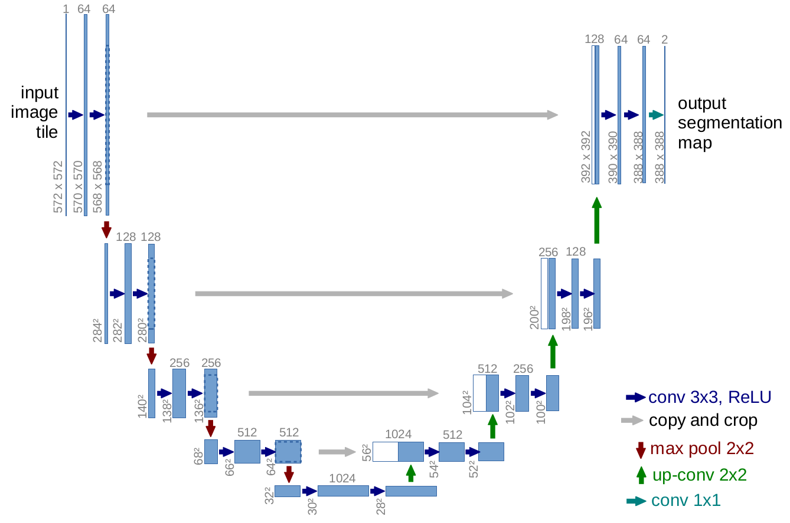

## 摘要

　　人们普遍同意，成功地训练深度网络需要数千个带注释的训练样本。在本文中，我们提出了一种网络和训练策略，该策略依靠大量使用数据增强功能来更有效地使用可用的带注释的样本。该体系结构包括捕获上下文的收缩路径和实现精确定位的对称扩展路径。我们展示了这样的网络可以从很少的图像进行端到端训练，并且在ISBI挑战方面优于现有的最佳方法（滑动窗口卷积网络），可用于分割电子显微镜堆栈中的神经元结构。使用在透射光显微镜图像（相差和DIC）上训练过的同一网络，我们在这些类别中赢得了2015年ISBI细胞跟踪挑战赛的冠军。而且，网络速度很快。在最新的GPU上，对512x512图像进行分割所需的时间不到一秒钟。

完整的实现（基于Caffe）和受过培训的网络可在http://lmb.informatik.uni-freiburg.de/people/ronneber/u-net上获得。

---

##### 图1. U-net架构（最低分辨率的32x32像素示例）。 每个蓝色框对应一个多通道特征图。 通道数标在方框的顶部。 x-y尺寸位于框的左下边缘。 白框代表复制的要素图。 箭头表示不同的操作。

## 引言

　　在过去的两年中，深度卷积网络在许多视觉识别任务中的表现超越了现有技术。 [7,3]。 尽管卷积网络已经存在很长时间了[8]，但由于可用训练集的大小和所考虑的网络的大小，卷积网络的成功受到限制。 Krizhevsky等人的突破。 [7]是由于对具有8层的大型网络和具有100万个训练图像的ImageNet数据集上的数百万个参数进行了监督训练。 从那时起，甚至更大更深的网络也得到了培训[12]。
卷积网络的典型用途是用于分类任务，其中图像的输出是单个类别标签。 然而，在许多视觉任务中，特别是在生物医学图像处理中，期望的输出应包括定位，即，应该将类别标签分配给每个像素。 此外，在生物医学任务中通常无法获得数千个训练图像。
因此，Ciresan等。 [1]通过在滑动窗口设置中训练网络来预测每个像素的类别标签，方法是在该像素周围提供一个局部区域（补丁）作为输入。 首先，该网络可以本地化。 其次，就补丁而言，训练数据远大于训练图像的数量。 最终的网络在ISBI 2012上大幅度赢得了EM细分挑战。
显然，Ciresan等人的策略。 [1]有两个缺点。首先，它很慢，因为必须为每个修补程序分别运行网络，并且由于修补程序重叠而导致大量冗余。其次，在定位精度和上下文使用之间需要权衡。较大的修补程序需要更多的最大池化层，这会降低定位精度，而较小的修补程序使网络只能看到很少的上下文。最近的方法[11,4]提出了一种分类器输出，该输出考虑了来自多层的特征。良好的本地化和上下文的使用是可能的。
在本文中，我们基于更优雅的架构，即所谓的“全卷积网络” [9]。我们修改并扩展了此体系结构，使其可以使用很少的训练图像并产生更精确的分割。参见图1。[9]中的主要思想是通过连续的层来补充通常的合同网络，其中合并池运算符被上采样运算符代替。因此，这些层增加了输出的分辨率。为了定位，将收缩路径中的高分辨率特征与上采样的输出结合在一起。然后，连续的卷积层可以根据此信息学习组装更精确的输出。
我们架构的一项重要修改是，在上采样部分，我们还拥有大量功能通道，这些功能通道允许网络将上下文信息传播到更高分辨率的层。结果，扩展路径或多或少地相对于收缩路径对称，并且产生了U形结构。网络没有任何完全连接的层，仅使用每个卷积的有效部分，即，分割图仅包含像素，在输入图像中可以使用其完整上下文。
这种策略允许通过重叠拼贴策略对任意大图像进行无缝分割（参见图2）。为了预测图像边界区域中的像素，可通过镜像输入图像来推断缺失的上下文。
这种平铺策略对于将网络应用于大图像非常重要，因为否则分辨率会受到GPU内存的限制。
至于我们的任务，几乎没有可用的训练数据，我们通过对可用的训练图像应用弹性变形来使用过多的数据增强。这允许网络学习此类变形的不变性，而无需在带注释的图像语料库中查看这些转换。这在生物医学分割中尤其重要，因为变形曾经是组织中最常见的变化，并且可以有效地模拟实际变形。 Dosovitskiy等人已经证明了数据增强对于学习不变性的价值。 [2]在无监督特征学习的范围内。
许多细胞分割任务中的另一个挑战是分离同一类别的接触对象。参见图3。为此，我们建议使用加权损失，其中触摸单元之间的分离背景标签在损失函数中获得较大的权重。
所得的网络适用于各种生物医学分割问题。在本文中，我们展示了关于EM堆栈中神经元结构分割的结果（一场持续的竞争始于ISBI 2012），在此方面我们胜过了Ciresan等人的网络。 [1]。此外，我们在来自ISBI细胞追踪挑战赛2015的光学显微镜图像中显示了细胞分割的结果。在这里，我们在两个最具挑战性的2D透射光数据集上大获全胜。

---

## 网络结构

　　网络结构如图1所示。它由一个收缩路径（左侧）和一个扩展路径（右侧）组成。收缩路径遵循卷积网络的典型架构。它由两个3x3卷积（unpadded卷积）的重复应用组成，每个卷积后跟一个整流线性单位（ReLU）和一个2x2 max-pooling运算，步长为2用于下采样。在每个降采样步骤中，我们将特征通道的数量加倍。
扩展路径中的每个步骤都包括对特征图进行上采样，然后进行2x2卷积(“up-convolution”)，以将特征通道的数量减半，并与从收缩路径中相应裁剪的特征图进行级联，再进行两个3x3卷积，每个后跟一个ReLU。
由于每次卷积中都会丢失边界像素，因此有必要进行裁剪。在最后一层，使用1x1卷积将每个64分量特征向量映射到所需的类数。该网络总共有23个卷积层。
为了无缝拼接输出分割图（请参见图2），重要的是选择输入图块大小，以便将所有2x2 max-pooling操作应用于x和y大小均等的图层。

---