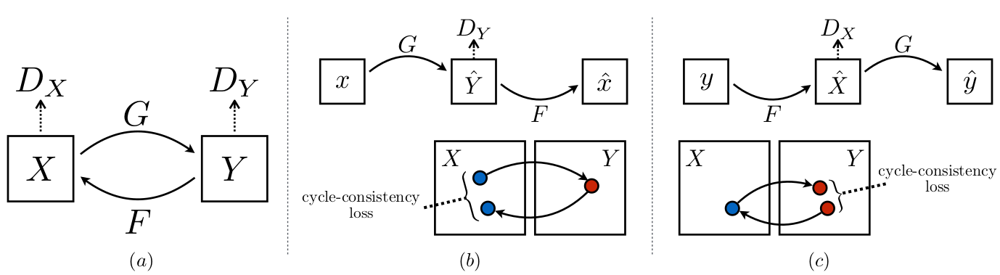

## 公式

###### 图3：（a）我们的模型包含两个映射函数G：X→Y和F：Y→X，以及相关的对抗性鉴别符D [Y]和D [X]。 D [Y]鼓励G将X转换为与域Y不可区分的输出，反之亦然，D [X]和F则相反。 为了进一步规范化映射，我们引入了两个周期一致性损失，它们捕捉了直觉，如果我们将一个域转换为另一域然后再次返回，则应该到达开始的位置：(b)正向周期一致性损失：x→G(x)→F(G(x))≈x，(c)后向循环一致性损失：y→F(y)→G(F(y))≈y

　　我们的目标是在给定训练样本{x [i]} N [i] = 1的情况下学习两个域X和Y之间的映射函数，其中1 x [i]∈X和{y [j]} M [j] = 1 y [j]∈Y。 我们将数据分布表示为x〜p数据（x）和y〜p数据（y）。 如图3（a）所示，我们的模型包括两个映射G：X→Y和F：Y→X。此外，我们引入了两个对抗性鉴别符D [X]和D [Y]，其中D [X]的目标 区分图像{x}和翻译图像{F（y）}； 同样，D [Y]旨在区分{y}和{G（x）}。 我们的目标包含两种类型的术语：对抗损失[16]，用于将生成的图像的分布与目标域中的数据分布进行匹配； 以及循环一致性损失，以防止学习到的映射G和F相互矛盾。

---

## 实现

### 网络结构

　　我们采用Johnson等人的生成网络的体系结构。 [23]他们在神经风格转移和超分辨率方面显示了令人印象深刻的结果。 该网络包含两个步幅2卷积，几个残差块[18]和两个步幅为12的分数步卷积。 我们对128×128图像使用6个块，对256×256和更高分辨率的训练图像使用9个块。 与Johnson等类似。 [23]，我们使用实例规范化[53]。 对于鉴别器网络，我们使用70×70个PatchGAN [22、30、29]，其目的是对70×70个重叠的图像块是真实的还是假的进行分类。 这种补丁级鉴别器架构的参数比完整图像鉴别器少，并且可以以完全卷积的方式处理任意大小的图像[22]。

### 训练详情

　　我们运用最新工作中的两种技术来稳定我们的模型训练过程。首先，对于L [GAN]（等式1），我们用最小二乘损失代替负对数似然目标[35]。这种损失在训练过程中更加稳定，并产生更高质量的结果。特别是，对于GAN损耗L [GAN](G，D，X，Y)，我们训练G使E [x〜p [data](x)] [(D(G(x))− 1 )²]，并训练D使E [y〜p [data](y)] [(D(y)-1)²] + E [x〜p [data](x)] [D(G( x))²]。

　　其次，为减少模型振荡[15]，我们遵循Shrivastava等人的策略[46]，并使用生成图像的历史记录而不是由最新生成器生成的图像来更新鉴别器。我们保留一个图像缓冲区，用于存储50个先前创建的图像。对于所有实验，我们在公式3中设置λ=10。我们使用批量大小为1的Adam解算器[26]。所有网络均从零开始进行学习，学习率为0.0002。我们在前100个时期保持相同的学习率，并在接下来的100个时期将学习率线性衰减为零。请参阅附录（第7节）以获取有关数据集，体系结构和培训过程的更多详细信息。

----