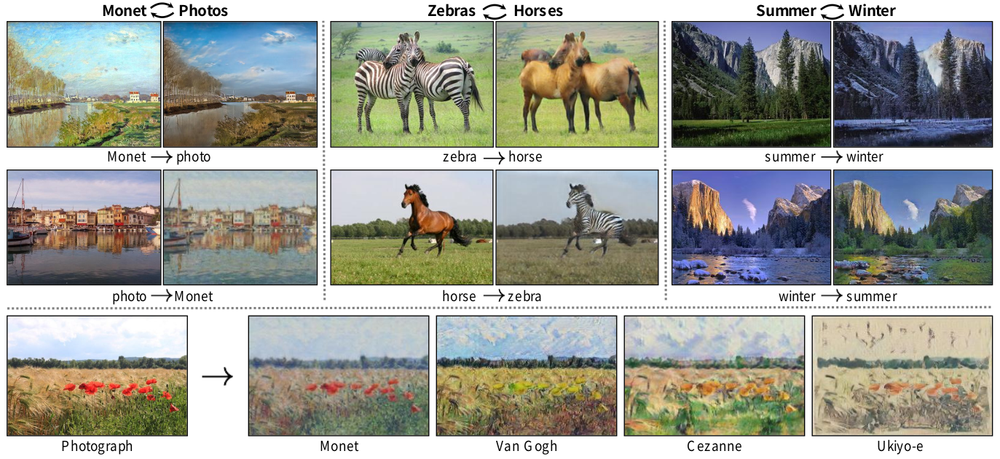
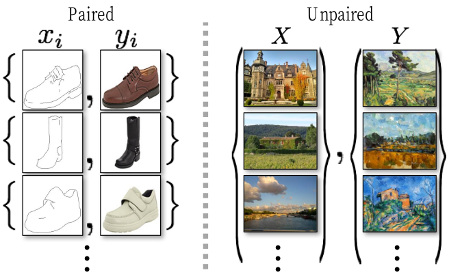
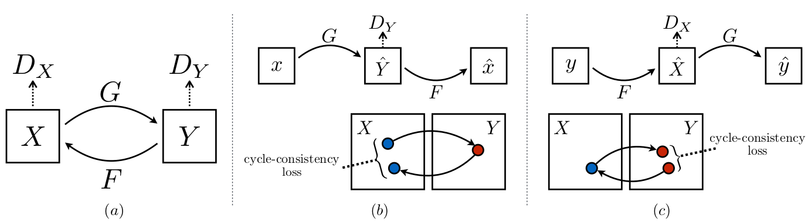

## 摘要

图像到图像的翻译是一类视觉和图形问题，其目标是使用对齐的图像对训练集来学习输入图像和输出图像之间的映射。

但是，对于许多任务，配对的训练数据将不可用。

我们提出了一种在没有配对示例的情况下学习将图像从源域X转换为目标域Y的方法。

我们的目标是学习一个映射G：X→Y，使得来自G（X）的图像分布与D的分布使用对抗损失是无法区分的。

由于此映射的约束严重不足，因此我们将其与反映射F：Y→X耦合，并引入循环一致性损失以强制执行F（G（X））≈X（反之亦然）。

定性结果在不存在配对训练数据的多个任务上显示，包括收集样式转移，对象变形，季节转移，照片增强等。

与几种先前方法的定量比较证明了我们方法的优越性。

---

## 引言

##### 图1：给定任意两个无序的图像集合X和Y，我们的算法学习自动将图像从一个图像“转换”到另一个图像，反之亦然：（左）来自Flickr的莫奈绘画和风景照片； ImageNet的（中心）斑马和马； （右）Flickr的夏季和冬季优胜美地照片。 示例应用程序（底部）：通过使用著名艺术家的绘画作品集，我们的方法学习将自然照片渲染成各自的风格。

克劳德·莫奈（Claude Monet）在1873年一个可爱的春天里，将画架放在塞纳河岸附近的阿根廷人附近时，看到了什么（图1，左上）？

如果发明了彩色照片，则可能记录了湛蓝的天空和反射着它的玻璃状河流。

莫奈通过细腻的笔触和明亮的调色板传达了他对同一场景的印象。

如果莫奈在一个凉爽的夏日夜晚发生在卡西斯（Cassis）的小港口上，该怎么办（图1，左下）？

短暂浏览莫奈画作的画廊，可以想象他将如何渲染场景：也许是柔和的阴影，突然的油漆点涂和动态范围平坦。

我们可以想象所有这一切，尽管从未在他所画的场景照片旁边看到莫奈画作的并排示例。

我们可以想象所有这一切，尽管从未在他所画的场景照片旁边看到莫奈画作的并排示例。

取而代之的是，我们了解了莫奈的绘画和风景照。

我们可以推断出这两个集合之间的风格差异，从而可以想象如果将场景从一个集合“转换”到另一个集合中，场景将是什么样子。

##### 图2：成对的训练数据（左）由训练示例{x [i]，y [i]} N [i] = 1组成，其中x [i]和y [i]之间存在对应关系[22]。 我们改为考虑不成对的训练数据（右），它由源集{x [i]} N [i] = 1（x [i]∈X）和目标集{y [j]} j = 1（y [j]∈Y），没有提供有关x [i]与哪个y [j]匹配的信息。

这个问题可以更广泛地描述为图像到图像的转换[22]，将图像从给定场景x的一种表示形式转换为另一种y，例如将灰度转换为颜色，将图像转换为语义标签，将边缘映射转换为照片。 。

多年来在计算机视觉，图像处理，计算摄影和图形方面的研究已经在有监督的环境下产生了功能强大的翻译系统，其中示例图像对{xi，yi} N i = 1可用（图2，左），例如[ 11、19、22、23、28、33、45、56、58、62]。

然而，获得成对的训练数据可能是困难且昂贵的。例如，仅存在用于语义分割等任务的几个数据集（例如[4]），并且它们相对较小。

由于所需的输出高度复杂（通常需要艺术创作），因此获取图形任务（如艺术风格）的输入输出对可能会更加困难。

对于许多任务，例如对象变形（例如，斑马，图1居中），所需的输出甚至都没有明确定义。

因此，我们寻求一种无需对输入/输出示例进行配对即可学会在域之间进行翻译的算法（右图2）。

我们假设这些域之间存在某种潜在的关系-例如，它们是同一基础场景的两个不同渲染-并试图学习这种关系。

尽管我们缺乏成对示例形式的监督，但是我们可以在集合级别上利用监督：我们在域X中获得了一组图像，在域Y中获得了一组不同的图像。

我们可以训练一个映射G：X→Y，使得输出的ŷ= G（x），x∈X与被图像分类为y的对手无法区分。

从理论上讲，该目标可以在ŷ上得出与经验分布p数据（y）匹配的输出分布（通常，这要求G是随机的）[16]。

因此，最优G将域X转换为与Y分布相同的域Ŷ。

但是，这种转换并不能保证单个输入x和输出y以有意义的方式配对-存在无限多个映射G，它们将在induce上引起相同的分布。

此外，在实践中，我们发现很难单独优化对抗目标：标准程序通常会导致众所周知的模式崩溃问题，即所有输入图像都映射到同一输出图像，并且优化无法取得进展[15] 。

这些问题要求为我们的目标增加更多的结构。

因此，我们利用翻译应该是“周期一致”的特性，即如果我们将一个句子从英语翻译成法语，然后再从法语翻译成英语，那么我们应该回到原始句子[3]。

从数学上讲，如果我们有一个翻译器G：X→Y和另一个翻译器F：Y→X，则G和F应该彼此相反，并且两个映射都应该是双射。

我们通过同时训练映射G和F并添加鼓励F（G（x））≈x和G（F（y））≈y的循环一致性损失[64]来应用此结构假设。

将这种损失与域X和Y上的对抗性损失结合起来，就可以得出我们未成对图像到图像转换的全部目标。

我们将我们的方法应用到广泛的应用程序中，包括收集样式转换，对象变形，季节转换和照片增强。

我们还与以前的方法进行了比较，后者依靠手工定义的样式和内容的因式分解或共享的嵌入函数，并表明我们的方法优于这些基准。

我们提供PyTorch和Torch实施。 在我们的网站上查看更多结果。

---

## 相关工作

##### 生成对抗网络(GAN)

　　GAN[16，63]在图像生成[6，39]，图像编辑[66]和表示学习[39，43，37]中取得了令人印象深刻的结果。 对于有条件的图像生成应用，例如text2image [41]，图像修复[38]和将来的预测[36]，以及其他领域，例如视频[54]和3D数据[57]，最新的方法采用相同的思想。 GAN取得成功的关键是对抗损失的想法，从原理上讲，所产生的图像与真实照片无法区分开。 这种损失对于图像生成任务尤其强大，因为这正是许多计算机图形学旨在优化的目标。 我们采取对抗性损失来学习映射，从而无法将翻译后的图像与目标域中的图像区分开。

##### 图像到图像的转换

　　图像到图像转换的想法至少可以追溯到Hertzmann等人的图像类比[19]，他们在单个输入输出训练图像对上采用了非参数纹理模型[10]。
较新的方法使用输入输出示例的数据集来学习使用CNN的参数转换功能（例如[33]）。 我们的方法基于Isola等人的“ pix2pix”框架。 [22]，它使用条件生成对抗网络[16]来学习从输入图像到输出图像的映射。 类似的想法已应用于各种任务，例如从草图[44]或从属性和语义布局[25]生成照片。 但是，与上述现有工作不同，我们在没有配对训练示例的情况下学习映射。

##### 未配对的图像到图像的转换

　　其他几种方法也可以解决不成对的设置，目标是关联两个数据域：X和Y。
罗萨莱斯等。 [42]提出了一种贝叶斯框架，该框架包括基于从源图像计算的基于补丁的马尔可夫随机场的先验和从多个样式图像获得的似然项。
最近，CoGAN [32]和跨模式场景网络[1]使用权重共享策略来学习跨域的通用表示。
与我们的方法同时，Liu等。 [31]结合变体自动编码器[27]和生成对抗网络[16]扩展了上述框架。
并发工作的另一行[46，49，2]鼓励输入和输出共享特定的“内容”功能，即使它们在“样式”上可能有所不同。
这些方法还使用对抗性网络，并带有附加项以在预定的度量空间（例如类标签空间[2]，图像像素空间[46]和图像特征空间[49]）中将输出强制为接近输入。
与上述方法不同，我们的公式不依赖于输入和输出之间任何特定于任务的预定义相似性函数，也不假定输入和输出必须位于相同的低维嵌入空间中。
这使我们的方法成为许多视觉和图形任务的通用解决方案。我们将直接与第5.1节中的几种现有方法和现代方法进行比较。

##### 周期一致性

　　使用可传递性来规范化结构化数据的想法由来已久。在视觉跟踪中，几十年来，强制执行简单的前后一致性一直是一种标准技巧[24，48]。在语言领域，通过“反向翻译和和解”来验证和改进翻译是人类翻译人员[3]（包括幽默地由马克·吐温[51]）以及机器[17]使用的一种技术。最近，在运动[61]，3D形状匹配[21]，同节[55]，密集语义对齐[65、64]和深度估计[14]中已在结构中使用了更高阶的循环一致性。其中，Zhou等。 [64]和Godard等。 [14]与我们的工作最相似，因为他们使用循环一致性损失作为使用传递性来监督CNN训练的一种方式。在这项工作中，我们引入了类似的损失来推动G和F彼此一致。与我们的工作同时，在这些相同的程序中，Yi等人。 [59]在机器翻译中的双重学习的启发下，独立地将相似的目标用于未配对的图像到图像的翻译[17]。

##### 神经风格转换

　　神经样式转换[13，23，52，12]是另一种执行图像间转换的方法，该方法通过基于匹配将一个图像的内容与另一图像（通常是绘画）的样式相结合来合成新颖的图像 预训练深度特征的Gram矩阵统计信息。 另一方面，我们的主要重点是通过尝试捕获高层外观结构之间的对应关系，来学习两个图像集合之间的映射，而不是两个特定图像之间的映射。 因此，我们的方法可以应用于其他任务，例如绘画→照片，物体变形等，这些情况下单个样本转移方法效果不佳。 我们将在5.2节中比较这两种方法。

---

## 公式

###### 图3：（a）我们的模型包含两个映射函数G：X→Y和F：Y→X，以及相关的对抗性鉴别符D [Y]和D [X]。 D [Y]鼓励G将X转换为与域Y不可区分的输出，反之亦然，D [X]和F则相反。 为了进一步规范化映射，我们引入了两个周期一致性损失，它们捕捉了直觉，如果我们将一个域转换为另一域然后再次返回，则应该到达开始的位置：(b)正向周期一致性损失：x→G(x)→F(G(x))≈x，(c)后向循环一致性损失：y→F(y)→G(F(y))≈y

　　我们的目标是在给定训练样本{x [i]} N [i] = 1的情况下学习两个域X和Y之间的映射函数，其中1 x [i]∈X和{y [j]} M [j] = 1 y [j]∈Y。 我们将数据分布表示为x〜p数据（x）和y〜p数据（y）。 如图3（a）所示，我们的模型包括两个映射G：X→Y和F：Y→X。此外，我们引入了两个对抗性鉴别符D [X]和D [Y]，其中D [X]的目标 区分图像{x}和翻译图像{F（y）}； 同样，D [Y]旨在区分{y}和{G（x）}。 我们的目标包含两种类型的术语：对抗损失[16]，用于将生成的图像的分布与目标域中的数据分布进行匹配； 以及循环一致性损失，以防止学习到的映射G和F相互矛盾。

---

## 实现

### 网络结构

　　我们采用Johnson等人的生成网络的体系结构。 [23]他们在神经风格转移和超分辨率方面显示了令人印象深刻的结果。 该网络包含两个步幅2卷积，几个残差块[18]和两个步幅为12的分数步卷积。 我们对128×128图像使用6个块，对256×256和更高分辨率的训练图像使用9个块。 与Johnson等类似。 [23]，我们使用实例规范化[53]。 对于鉴别器网络，我们使用70×70个PatchGAN [22、30、29]，其目的是对70×70个重叠的图像块是真实的还是假的进行分类。 这种补丁级鉴别器架构的参数比完整图像鉴别器少，并且可以以完全卷积的方式处理任意大小的图像[22]。

### 训练详情

　　我们运用最新工作中的两种技术来稳定我们的模型训练过程。首先，对于L [GAN]（等式1），我们用最小二乘损失代替负对数似然目标[35]。这种损失在训练过程中更加稳定，并产生更高质量的结果。特别是，对于GAN损耗L [GAN](G，D，X，Y)，我们训练G使E [x〜p [data](x)] [(D(G(x))− 1 )²]，并训练D使E [y〜p [data](y)] [(D(y)-1)²] + E [x〜p [data](x)] [D(G( x))²]。

　　其次，为减少模型振荡[15]，我们遵循Shrivastava等人的策略[46]，并使用生成图像的历史记录而不是由最新生成器生成的图像来更新鉴别器。我们保留一个图像缓冲区，用于存储50个先前创建的图像。对于所有实验，我们在公式3中设置λ=10。我们使用批量大小为1的Adam解算器[26]。所有网络均从零开始进行学习，学习率为0.0002。我们在前100个时期保持相同的学习率，并在接下来的100个时期将学习率线性衰减为零。请参阅附录（第7节）以获取有关数据集，体系结构和培训过程的更多详细信息。

----