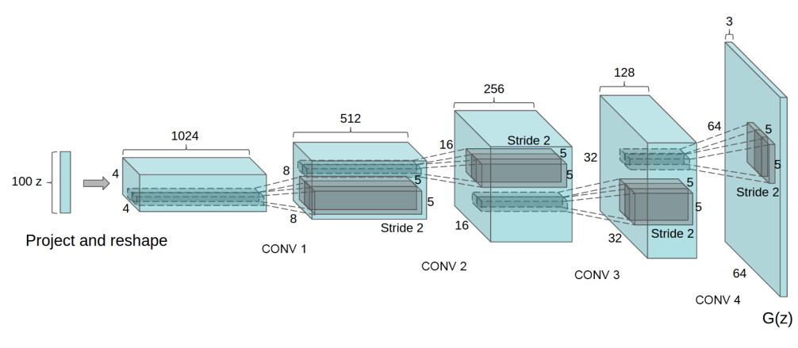

## 摘要

近年来，通过卷积网络（CNN）进行监督学习已在计算机视觉应用中得到了广泛采用。 相比之下，CNN的无监督学习受到的关注较少。 在这项工作中，我们希望有助于弥合CNN在监督学习和无监督学习方面的成功。 我们介绍了一种称为深度卷积生成对抗网络（DCGAN）的CNN，它们具有一定的体系结构约束，并证明它们是无监督学习的强大候选人。 在各种图像数据集上进行训练后，我们显示出令人信服的证据，证明我们的深度卷积对抗对在生成器和鉴别器中学习了从对象部分到场景的表示层次。 此外，我们将学习到的功能用于新颖的任务-展示了它们作为一般图像表示的适用性。

---

## 引言

从大型未标记数据集中学习可重用特征表示法一直是积极研究的领域。 在计算机视觉的背景下，人们可以利用几乎无限量的未标记图像和视频来学习良好的中间表示，然后可以将其用于各种有监督的学习任务，例如图像分类。 我们建议，一种构建良好图像表示的方法是通过训练生成对抗网络（GAN）（Goodfellow等人，2014年），然后将生成器和鉴别器网络的某些部分重用作为受监管任务的特征提取器。  GAN为最大似然技术提供了有吸引力的替代方法。
有人可能会说，他们的学习过程和缺乏启发式成本函数（如像素方向独立的均方误差）对表示学习很有吸引力。 众所周知，GAN训练起来不稳定，通常会导致发电机产生无意义的输出。
在试图理解和可视化GAN学习的知识以及多层GAN的中间表示形式方面，已经发表的研究非常有限。

在本文中，我们做出了以下贡献：
- 我们提出并评估了卷积GAN的体系结构拓扑上的一组约束条件，这些约束条件使其在大多数情况下都能稳定地训练。 我们将此类架构命名为深度卷积GAN（DCGAN）
- 我们使用训练有素的鉴别器来进行图像分类任务，从而显示出与其他无监督算法的竞争性能。
- 我们将GAN所学习的过滤器可视化，并根据经验表明特定的过滤器已学会绘制特定的对象。
- 我们证明了生成器具有有趣的矢量算术特性，可以轻松操纵生成样本的许多语义质量。

---
## 相关工作

### 来自未经标记的数据的表示学习

在一般的计算机视觉研究以及图像环境中，无监督表示学习是一个相当好的研究问题。 无监督表示学习的经典方法是对数据进行聚类（例如使用K-means），并利用聚类来提高分类得分。 在图像的上下文中，可以对图像补丁进行分层聚类（Coates和Ng，2012），以学习功能强大的图像表示。 另一种流行的方法是训练自动编码器（卷积，堆叠（Vincent等人，2010），分离代码的内容和位置（Zhao等人，2015），梯形结构（Rasmus等人，2015）。  ），将图像编码为紧凑代码，然后对代码进行解码，以尽可能准确地重建图像。 还显示了这些方法可从图像像素学习良好的特征表示。 深度信念网络（Lee等人，2009）也被证明在学习层次表示中表现良好。

### 生成自然图像

生成图像模型已得到很好的研究，分为两类：参数化和非参数化。

非参数模型通常会从现有图像的数据库中进行匹配，通常会匹配图像的补丁，并已用于纹理合成（Efros等人，1999），超分辨率（Freeman等人，2002）和 绘画（Hays和Efros，2007年）。

已经广泛探索了用于生成图像的参数模型（例如，在MNIST数字上或用于纹理合成（Portilla＆Simoncelli，2000））。 但是，直到最近，生成现实世界的自然图像并没有取得太大的成功。 一种用于生成图像的变分采样方法（Kingma＆Welling，2013年）取得了一些成功，但是样本经常会变得模糊。 另一种方法是使用迭代正向扩散过程生成图像（Sohl-Dickstein等人，2015）。 生成对抗网络（Goodfellow et al。，2014）产生的图像饱受噪音和难以理解的困扰。 这种方法的拉普拉斯金字塔扩展（Denton等人，2015）显示了更高质量的图像，但是由于链接多个模型时引入了噪声，它们仍然遭受对象看起来不稳定的困扰。 最近，递归网络方法（Gregor等，2015）和反卷积网络方法（Dosovitskiy等，2014）在生成自然图像方面也取得了一些成功。 但是，他们没有利用生成器来执行受监管的任务。

### 可视化CNNS内部

使用神经网络的一种经常的批评是，它们是黑盒方法，对以简单的人类消耗算法的形式进行的网络知之甚少。 在CNN的背景下，Zeiler等。 等 （Zeiler＆Fergus，2014）表明，通过使用反卷积并过滤最大激活量，可以找到网络中每个卷积滤波器的近似目的。 类似地，在输入上使用梯度下降使我们可以检查激活了滤镜某些子集的理想图像（Mordvintsev等）。

---
## 方法和模型架构

使用CNN建模图像来扩大GAN的历史性尝试均未成功。 这激励了LAPGAN的作者（Denton等人，2015）开发一种替代方法来逐步生成低分辨率生成的图像，并且可以更可靠地对其进行建模。 我们还遇到了使用受监管文献中常用的CNN架构扩展GAN的困难。 但是，在进行了广泛的模型探索之后，我们确定了一组体系结构，这些体系结构可对一系列数据集进行稳定的训练，并允许训练更高分辨率和更深入的生成模型。
我们方法的核心是采用和修改最近展示的对CNN结构的三个更改。

第一个是全卷积网络（Springenberg等，2014），它用strided卷积代替了确定性空间池化功能（例如maxpooling），从而使网络能够学习自己的空间下采样。 我们在生成器中使用此方法，从而使其能够学习自己的空间上采样和鉴别器。

第二个趋势是在卷积特征之上消除完全连接的层的趋势。
最有力的例子是全局平均池，该池已在最先进的图像分类模型中使用（Mordvintsev等）。我们发现全局平均池增加了模型的稳定性，但损害了收敛速度。 将最高卷积特征直接连接到生成器和鉴别器的输入和输出的中间立场很好。GAN的第一层采用均匀的噪声分布Z作为输入，可以被称为完全连接，因为它只是矩阵乘法，但是结果被重塑为4维张量并用作卷积堆栈的起点。对于鉴别器，最后的卷积层被展平，然后馈入单个S型输出。 有关示例模型架构的可视化效果，请参见图1。

##### 图1：用于LSUN场景建模的DCGAN生成器。 将100维均匀分布Z投影到具有许多特征图的小空间范围卷积表示。一系列的四个分数步法卷积（在最近的一些论文中，这些卷积被错误地称为反卷积），然后将这种高级表示形式转换为64×64像素的图像。 值得注意的是，没有使用完全连接或合并的层。

第三是批次归一化（Ioffe＆Szegedy，2015），它通过将每个单元的输入归一化为零均值和方差来稳定学习。 这有助于处理由于初始化不当而引起的训练问题，并有助于在更深的模型中进行梯度流动。 事实证明，这对于让深入的生成器开始学习，防止生成器将所有样本崩溃到单个点至关重要，这是GAN中常见的故障模式。 但是，直接将batchnorm应用于所有层会导致样品振荡和模型不稳定。 通过不将batchnorm应用于生成器输出层和鉴别器输入层，可以避免这种情况。
生成器中使用ReLU激活（Nair＆Hinton，2010），但使用Tanh函数的输出层除外。 我们观察到，使用有界激活可以使模型更快地学习以饱和并覆盖训练分布的色彩空间。 在鉴别器内，我们发现泄漏的整流激活（Maas等，2013）（Xu等，2015）可以很好地工作，特别是对于更高分辨率的建模。 这与最初的GAN论文相反，后者使用了maxout激活（Goodfellow等，2013）。

稳定的深度卷积GAN的架构指南：
- 用跨步卷积（鉴别器）和分数跨步卷积（生成器）替换所有池化层。
- 在生成器和鉴别器中都使用batchnorm。
- 删除完全连接的隐藏层以获得更深的体系结构。
- 在生成器中的所有层上使用ReLU激活，但输出除外，后者使用Tanh。
- 对所有层在鉴别器中使用LeakyReLU激活。

---
## 对抗训练的细节

我们在三个数据集上训练了DCGAN，三个数据集是大型场景理解（LSUN）（Yu等人，2015），Imagenet-1k和一个新组装的Faces数据集。 下面给出了有关每个数据集用法的详细信息。

除了缩放到tanh激活函数的范围[-1，1]之外，没有对训练图像进行任何预处理。 所有模型均使用最小批量大小为128的微型批量随机梯度下降（SGD）进行训练。所有权重均从零中心正态分布初始化，标准偏差为0.02。 在LeakyReLU中，所有模型的泄漏斜率均设置为0.2。
尽管GAN之前的工作是利用动量来加快训练速度，但我们使用了带有优化超参数的Adam优化器（Kingma＆Ba，2014）。 我们发现建议的学习率0.001太高，而使用0.0002代替。 此外，我们发现将动量项β1保持在建议值0.9会导致训练震荡和不稳定性，而将其减小到0.5有助于稳定训练。

---
## LSUN

随着来自生成图像模型的样本的视觉质量的提高，对训练样本的过度拟合和记忆的关注日益增加。 为了演示我们的模型如何利用更多的数据和更高的分辨率生成规模，我们在LSUN卧室数据集中训练了一个模型，其中包含了略超过300万个训练示例。 最近的分析表明，模型学习的速度与其泛化性能之间存在直接的联系（Hardt等人，2015）。 除了展示收敛之后的样本（图3），我们还展示了模仿在线学习的一个时期的训练样本（图2），以此为契机来证明我们的模型不是通过简单拟合/记忆训练来生成高质量样本 例子。 没有将数据增强应用于图像。

### 重复数据删除

为了进一步降低发生器记忆输入示例的可能性（图2），我们执行了一个简单的图像重复数据删除过程。 我们在训练示例的32x32下采样中心作物上安装了3072-128-3072去噪掉落正则化RELU自动编码器。 然后，通过对ReLU激活进行阈值化来对生成的代码层激活进行二值化，这已被证明是一种有效的信息保存技术（Srivastava等，2014），并提供了一种方便的语义哈希形式，允许进行线性时间重复数据删除。 哈希检查的目视检查显示出很高的准确性，估计的误报率不到100分之一。此外，该技术还检测并删除了大约275,000个重复项，表明召回率很高。

### 脸

我们从人名的随机Web图像查询中抓取了包含人脸的图像。 这些人的名字是从dbpedia获得的，其标准是他们出生于现代时代。
该数据集包含1万个人的3M图像。 我们在这些图像上运行OpenCV人脸检测器，保持足够高分辨率的检测，这使我们获得了大约350,000个人脸检测盒。 我们使用这些脸盒进行训练。 没有数据增强应用于图像。

---

---