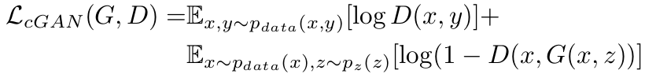
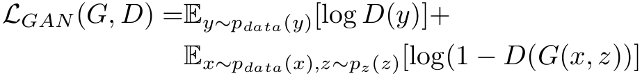
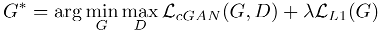

## 摘要

　　我们研究条件对抗网络作为图像到图像翻译问题的通用解决方案。

　　这些网络不仅学习从输入图像到输出图像的映射，而且学习损失函数来训练该映射。

　　这使得可以将相同的通用方法应用于传统上需要非常不同的损失公式的问题。

　　我们证明了这种方法可以有效地从标签图合成照片，从边缘图重建对象以及为图像着色等任务。 作为一个社区，我们不再需要手工设计映射功能，这项工作表明我们无需手工设计损失函数就可以取得合理的结果。

---

## 引言
 
　　图像处理，计算机图形学和计算机视觉中的许多问题都可被视为将输入图像“转换”为相应的输出图像。

　　正如可以用英语或法语表达概念一样，可以将场景渲染为RGB图像，梯度场，边缘图，语义标签图等。

　　与自动语言翻译类似，我们将自动图像到图像翻译定义为在给定足够的训练数据的情况下将场景的一种可能表示转换为另一种场景的问题（参见图1）。

　　语言翻译困难的一个原因是，语言之间的映射很少一对一映射，因此任何给定的概念都比另一种语言更易于表达。

　　同样，大多数图像到图像的翻译问题要么是多对一（计算机视觉）-将照片映射到边缘，片段或语义标签，要么是一对多（计算机图形）-映射标签或用户输入稀疏到逼真的图像。

　　传统上，这些任务中的每一项都是由单独的专用机器（例如[7、15、11、1、3、37、21、26、9、42、46]）处理的，尽管始终相同：根据像素预测像素。本文的目标是为所有这些问题开发一个通用框架。

## 相关工作

##### 图像建模的结构化损失

　　我们的条件GAN的不同之处在于损失是可学习的

##### 条件GAN

　　我们的框架的不同之处在于，没有什么是特定于应用程序的。这使我们的设置比大多数其他设置简单得多。

　　我们的生成器，我们使用基于“ U-Net”的体系结构[34]。

　　对于我们的鉴别器，我们使用卷积的“ PatchGAN”分类器，该分类器仅在图像补丁范围内惩罚结构。先前在[25]中提出了类似的PatchGAN架构，以获取本地样式统计信息。在这里，我们证明了这种方法对更广泛的问题有效，并且我们研究了更改补丁大小的效果。

---

## 方法

### 目的

条件GAN的目标可以被表示为：

G试图将这个目标最小化，而对抗者D则试图将其最大化，即 
G∗= arg minG maxD LcGAN (G, D)

To test the importance of conditioning the discrimintor,we also compare to an unconditional variant in which the discriminator does not observe x: 
为了测试条件判别器的重要性，我们还与不遵守x的无条件变量的判别器进行了比较：

Previous approaches to conditional GANs have found it beneficial to mix the GAN objective with a more traditional loss, such as L2 distance [29].  
以前的cGAN的方法已经发现，将GAN目标与更传统的损失（例如L2距离）混合是有益的[29]。 

The discriminator’s job remains unchanged, but the generator is tasked to not only fool the discriminator but also to be near the ground truth output in an L2 sense.  
鉴别器的工作保持不变，但是生成器的任务不仅是欺骗鉴别器，而且还要使它接近L2意义上的地面真相输出。 

We also explore this option, using L1 distance rather than L2 as L1 encourages less blurring: 
我们还探索了此选项，使用L1距离而不是L2，因为L1鼓励减少模糊：
.png)

我们最终的目标是：

Without z, the net could still learn a mapping from x to y, but would produce deterministic outputs, and therefore fail to match any distribution other than a delta function. 
没有z，网络仍然可以学习从x到y的映射，但是会产生确定性的输出，并因此无法匹配除增量函数以外的任何分布。

Past conditional GANs have acknowledged this and provided Gaussian noise z as an input to the generator, in addition to x (e.g., [39]).  
过去的条件GAN都已经意识到了这一点，并提供了高斯噪声z作为生成器除了x之外 的输入（例如[39]）。

In initial experiments, we did not find this strategy effective – the generator simply learned to ignore the noise – which is consistent with Mathieu et al. [27]. 
在最初的实验中，我们没有发现这种策略有效（生成器只是学会了忽略噪声），这与Mathieu等人的观点一致。 [27]。

Instead, for our final models, we provide noise only in the form of dropout, applied on several layers of our generator at both training and test time.  
取而代之的是，对于最终模型，我们仅以dropout的形式提供噪声，并在训练和测试时将其应用于发生器的多个层。

Despite the dropout noise, we observe very minor stochasticity in the output of our nets. 
尽管有噪声，但我们的网络输出中观察到的随机性很小。

Designing conditional GANs that produce stochastic output, and thereby capture the full entropy of the conditional distributions they model, is an important question left open by the present work. 
设计产生随机输出的条件GAN，从而捕获它们建模的条件分布的全部熵，是当前工作遗留的一个重要问题。

### 网络结构

We adapt our generator and discriminator architectures from those in [30]. Both generator and discriminator use modules of the form convolution-BatchNorm-ReLu [18].
Details of the architecture are provided in the appendix,with key features discussed below： 
我们从[30]中的生成器和鉴别器体系结构中进行调整。 生成器和鉴别器都使用 convolution-BatchNorm-ReLu [18]形式的模块。
附录中提供了该体系结构的详细信息，下面讨论了一些关键功能：

#### 跳跃生成器

A defining feature of image-to-image translation problems is that they map a high resolution input grid to a high resolution output grid.  
图像到图像转换问题的定义特征是它们将高分辨率输入网格映射到高分辨率输出网格。

In addition, for the problems we consider,the input and output differ in surface appearance, but both are renderings of the same underlying structure.  
另外，对于我们考虑的问题，输入和输出的表面外观不同，但是两者都是相同基础结构的绘制。

Therefore,structure in the input is roughly aligned with structure in the output.  
因此，输入中的结构与输出中的结构大致对齐。

We design the generator architecture around these considerations. 
我们围绕这些考虑因素设计生成器体系结构。

Many previous solutions [29, 39, 19, 48, 43] to problems in this area have used an encoder-decoder network [16].  
针对该领域中的问题的许多先前解决方案[29、39、19、48、43]已经使用了编码器-解码器网络[16]。

In such a network, the input is passed through a series of layers that progressively downsample, until a bottleneck layer,at which point the process is reversed (Figure 3).  
在这样的网络中，输入将通过一系列逐渐递减采样的层，直到成为瓶颈层为止，在这一点上，过程将被逆转（图3）。

Such a network requires that all information flow pass through all the layers, including the bottleneck.  
例如，在图像着色的情况下，输入和输出共享突出边缘的位置。

For many image translation problems, there is a great deal of low-level information shared between the input and output, and it would be desirable to shuttle this information directly across the net. 
对于许多图像翻译问题，在输入和输出之间共享大量低级信息，因此希望将这些信息直接穿梭在网络上。

For example, in the case of image colorizaton, the input and output share the location of prominent edges. 
例如，在图像着色的情况下，输入和输出共享突出边缘的位置。

To give the generator a means to circumvent the bottleneck for information like this, we add skip connections,following the general shape of a “U-Net” [34] (Figure 3). 
为了给生成器一种避免此类信息瓶颈的方法，我们按照“ U-Net”的一般形状添加了跳过连接[34]（图3）。

Specifically, we add skip connections between each layer I and layer n − i, where n is the total number of layers. Each skip connection simply concatenates all channels at layer I with those at layer n − i. 
为了给生成器一种避免此类信息瓶颈的方法，我们按照“ U-Net”的一般形状添加了跳过连接[34]（图3）。

#### 马尔可夫鉴别器(PatchGAN)

#### 优化和推论

---