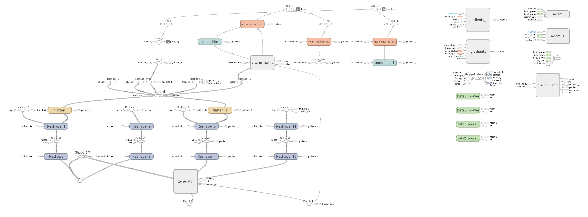

进入tmp/audio_to_pose/test_run/2019-12-02--14-27-52-573994
```
source activate speech2gesture_env_py27
```
```
tensorboard --logdir='/media/zb/UbuntuFile/LearningIndividualStylesOfConversationalGesture/tmp/audio_to_pose/test_run/2019-12-02--14-27-52-573994'
```


